# PAF

`paf` orchestrates a large population of noninteractive Codex workers over an informal
mathematics corpus and its Lean translation. It combines an optimistic parallel drafting pass with
coordinator-driven build convergence, MCP-backed fixup, editing mathematical review, and
LSP-backed proving.

Install `ripgrep` and ensure its `rg` executable is on `PATH` before starting a large swarm. Agents
use it for fast source and declaration searches. Worker-launching commands continue without it, but
print a prominent warning in headless/background mode or retain a warning banner in the TUI because
fallback searches can be substantially slower.

```mermaid
flowchart LR
    S[Scaffold directories] --> F[Formalize once]
    F -->|all drafts finished| I[Scan observed LastLib imports]
    I --> C{Source and dependencies already built?}
    C -->|no| O[Optimistic selected-scope build]
    C -->|yes| G{Review already succeeded?}
    O -->|failed diagnostics| B[Build dependency-ready chapter]
    O -->|clean| G
    B -->|initial build diagnostics| X[Fixup agents with MCP]
    X -->|patch merged| I
    B -->|clean| G
    G -->|no| R[Editing review]
    G -->|yes| P[Prove or revalidate proof]
    R -->|changed, findings, or build failure| R
    R -->|succeeded| P
    P -->|statement/API problem; reopen affected reviews| R
    P -->|missing earlier interface| UQ[Upstream request: requested]
    UQ --> UR[Temporary owner repair run]
    UR -->|exact answer persisted| UA[answered]
    UA --> UT[Fresh consumer proof run]
    UT -->|named declaration proved + Lean valid| UC[closed]
    UC --> P
    UQ -->|invalid request| UM[escalated]
    UR -->|no clean durable answer| UM
    UT -->|named declaration still blocked| UM
    P -->|no placeholders + Lean valid| D[Done]
```



Scaffolding is deterministic and creates directories only. Formalization then runs once for every
missing chapter scope without Lean or LSP validation, so chapters and books can draft concurrently
despite provisional imports. After all drafts finish, the coordinator discovers chapter edges with
regexes over the current `import LastLib...` lines and passes the complete dirty selected scope to
one optimistic Lake invocation. Lake schedules those targets against the Lean import graph. A clean
build records every selected source as fresh and skips fixup agents entirely. Otherwise the
coordinator routes diagnostics to their owning chapters and fixes the dependency-ready owners with
Lean MCP concurrently. As soon as an agent finishes, the coordinator merges it, rescans imports,
and rebuilds it once its refined predecessors are clean. After a partially failing grouped build,
the coordinator batches the remaining dependency-ready chapters into subsequent Lake invocations
instead of verifying them one by one; unrelated agents keep running and a successful repair build
immediately releases its review while fixup continues on other dependency-ready chapters. The final
stable verification is likewise one grouped Lake invocation.
All later coordinator checks use the same coalescer: fixup, review, proof refresh, and proof
certification requests that are pending together contribute targets to one Lake command, even
across stages. The highest-priority request supplies the batch priority, and any non-preemptible
request makes the shared command non-preemptible. If the command fails, diagnostics are routed to
their owning chapters and affected import descendants while independent targets are retried as one
smaller batch and retain their successful freshness records.
A review starts once its own fixup is clean and all of its observed dependencies have been reviewed;
there is no corpus-wide barrier between fixup and review. The coordinator remembers the source
digests of successful builds so it can avoid rebuilding unchanged chapters. Review has
no separate green flag: a successful review task is the whole state. Restarts and ordinary proof-body edits leave it
succeeded; explicit review findings, proof-requested statement/API repairs, and forced review reopen
only the reviews that receive findings. Reviewers directly make scoped statement and API repairs.
If a review edits source, transitive build freshness is invalidated and downstream proofs are
kept green when a fresh coordinator build still succeeds. Fixup ends once the initial post-draft
build has converged. Dependency-ready chapters receive prioritized, coalesced coordinator
verification after changed reviews; failures and structured findings return to review with the
diagnostics attached. After at most five
such cycles—or immediately after a no-change review—the chapter is
released to proving without waiting for reviews of its descendants.
Proof edits are validated by building their own chapter, but they do not invalidate or proactively
rebuild downstream chapters. Build freshness remains separate from review and proof task status.
Proof findings reopen review without invalidating build freshness; a subsequent review edit is what
marks the affected import closure stale.
Review agents read the assigned numbered textbook chapter and discover the assigned Lean files
dynamically, then use targeted searches in earlier LastLib and pinned Mathlib sources as questions
arise. They do not receive a prefabricated source packet. Fixup, review, and proof agents receive Lean MCP;
reviewers trust the last clean build for untouched files and request whole-file diagnostics
only for files they edit and the assigned transitive dependents invalidated by those edits. A
no-change review therefore needs no diagnostic calls.

Point the CLI at source files or directories. Directories are scanned recursively for Markdown,
LaTeX, and plain-text documents; metadata directories, hidden directories, build outputs, and
symlinked directories are skipped. A conventional numbered corpus also automatically reads
`BOOK_DEPENDENCIES.md` from the repository root:

```console
uv run paf plan books/
uv run paf corpus books/
```

Dependency documents use Mermaid edges such as `B01 --> B02 --> B03`; chained edges are expanded.
Pass `--dependencies path/to/graph.md` to select another graph. Dependencies whose books are outside
the selected target set are treated as already satisfied.

## Quick start

The project is managed with [uv](https://docs.astral.sh/uv/). A config file is optional: pass one
informal book Markdown file and PAF infers its title, numbered chapters, existing matching
Lean book module, validation commands, and isolated state directory.

```console
uv sync --all-groups
uv run paf plan books/02-finite-extensions-of-local-fields.md
uv run paf books/02-finite-extensions-of-local-fields.md
```

Install the command from a checkout with:

```console
uv tool install .
```

The distribution name is `paf`; after a release is published to the configured Python package
index, install that published release with:

```console
uv tool install paf
```

The distribution includes the prompt library and a prebuilt React UI. A normal wheel or sdist
installation does not require Node or npm.

Serve the installed dashboard and its project-scoped API from any directory with:

```console
paf web /absolute/path/to/project
```

It listens on `127.0.0.1:5173` by default. Network exposure is opt-in: pass
`--host 0.0.0.0` explicitly (and choose a different port with `--port`). The service reads source,
target, and durable run state only from the paths resolved by that project's `paf.toml`, including
an external `state_dir`.

Passing a `.md` as the first argument is shorthand for `pipeline <target>`. Zero-config runs default
to `gpt-5.6-luna`, reasoning effort `max`, the packaged generic prompt library under
`src/paf/prompts/`, automatic execution isolation, and a state directory at
`.paf/<inferred-book-id>/`. Fixup, review, and proof attempts attach a private Lean LSP MCP server;
drafting does not. Use
`paf.example.toml` when the inferred layout is not appropriate or when coordinating multiple books.

Any stage may point at a specialized prompt template. Supported replacement fields include
`{book_title}`, `{chapter_number}`, `{chapter_number_padded}`, `{chapter_title}`, `{source}`,
`{lean_root}`, `{chapter_path}`, `{chapter_module}`, and `{build_command}`.

The final agent prompt is composed from three deliberately separate layers: the selected stage
template defines its mission and workflow, packaged `prompts/common.md` defines shared mathematical
and import policy, and the generated runtime contract supplies the exact scope, MCP availability,
coordinator-owned build behavior, and structured-report requirements. Shared policy belongs in the
common layer rather than being copied into every stage template.

Proof agents must clear every MCP warning except “declaration uses `sorry`” for a theorem they
attempted but could not prove. Disabling a linter or warning option is not an acceptable fix.

Codex is invoked in its documented noninteractive JSONL mode with a strict final-report schema.
Every worker returns a nonempty, change-focused `summary`. For an accepted source change, the
coordinator copies that summary verbatim into the body of a path-scoped Conventional Commit such as
`chore(book07): changes from review agent on book 7 chapter 2`, and records the resulting commit SHA
with the run. The coordinator refuses to launch a worker whose exclusive scope already contains
uncommitted files, preventing earlier work from being folded into the worker's commit. Unrelated
staged and unstaged files remain outside the commit.
All swarm workers, including review workers, default to
`--dangerously-bypass-approvals-and-sandbox`, giving them full host access for unattended
formalization. The coordinator accepts review changes only inside the chapter's exclusive scope. To
opt into sandboxed workers, set `bypass_approvals_and_sandbox = false`; setting
`approve_for_me = true` then uses Codex's workspace-write sandbox for every mutating stage. See
OpenAI's official
[Codex non-interactive guidance](https://developers.openai.com/codex/noninteractive).

Transient model-capacity failures resume the same Codex thread with capped exponential backoff.
After the configured retries are exhausted, that stage fails instead of creating an unbounded stream
of fresh attempts. A failed chapter does not cancel unrelated formalizers; the pipeline finishes the
remaining drafting work before reporting failure.

## Commands

Inspect discovery and configuration without launching agents:

```console
uv run paf plan books/02-finite-extensions-of-local-fields.md
uv run paf plan --config paf.toml
```

Run an individual stage over the whole configured corpus or a selection:

```console
uv run paf stage formalize books/02-finite-extensions-of-local-fields.md
uv run paf stage fixup books/02-finite-extensions-of-local-fields.md
uv run paf stage review --config paf.toml --book book02
uv run paf stage prove --config paf.toml --book book02 --chapter 3
```

Create the deterministic directory scaffold without launching Codex:

```console
uv run paf scaffold books/02-finite-extensions-of-local-fields.md
```

Run the complete pipeline:

```console
uv run paf pipeline books/02-finite-extensions-of-local-fields.md
uv run paf corpus books/ --max-agents 24
```

The TUI is the default for stage and pipeline runs. Add `--no-tui` for CI, a process supervisor, or
log-only operation. Add `--force` to rerun tasks already persisted as successful. Without `--force`,
successful stages are resumable and skipped.

Inspect durable status without starting or mutating a run:

```console
uv run paf status books/02-finite-extensions-of-local-fields.md
uv run paf status --config paf.toml --json
```

Inspect the accumulated informal-textbook issue ledger:

```console
uv run paf source-issues books/02-finite-extensions-of-local-fields.md
uv run paf source-issues --config paf.toml --json
```

Every agent report has a structured `source_issues` field. Genuine textbook defects are recorded
with a precise location, exact identifying excerpt, mathematical explanation, and minimal suggested
replacement. The coordinator enriches each sighting with book, chapter, stage, and run provenance,
deduplicates repeated sightings, and persists the ledger at `.paf/.../source-issues.json` as well
as in the state snapshot. Detection does not stop an agent: it must make the principled accommodation
allowed by its stage and continue through all unaffected work. The ledger is evidence for a later
reviewed textbook patch; swarm workers do not rewrite the Markdown automatically.

`--chapter N` selects that chapter number in every selected book. Use the full chapter id when a
number would be ambiguous.

CLI overrides such as `--model`, `--reasoning-effort`, and `--max-agents` work with both inferred and
configured runs. `--isolation auto|fuse-overlay|shared` selects the execution backend.

After a foreground TUI closes with a failed result, the CLI prints the failed task details, compact
agent/build diagnostics, blocked dependents, and persisted state path to standard output.

## Frontend release bundle

Node is needed only by contributors rebuilding the React app. After changing `web/src`, frontend
configuration, or npm package metadata, prepare and verify the committed package assets with:

```console
cd web
npm ci
npm run release:bundle
cd ..
python scripts/web_bundle.py check
```

The release command writes content-hashed assets and a content manifest under
`src/paf/web_dist/`. The check compares SHA-256 digests rather than filesystem mtimes, so it detects
stale sources and edited build output consistently in fresh Git checkouts. To validate package
contents during release preparation:

```console
uv build
python scripts/check_distribution.py dist/*.whl dist/*.tar.gz
```

The full installed-package check builds both archive types, inspects their contents, installs each
one into a separate temporary virtual environment, and exercises the CLI and live web server from
outside this checkout:

```console
uv run python scripts/check_installed_distribution.py
```

It removes `PYTHONPATH`, disables user site packages, and verifies the imported `paf` location, so
the checkout cannot accidentally satisfy an installed-package probe.

## Lean LSP MCP proof loop

Every proof attempt receives its own locked
[`lean-lsp-mcp`](https://github.com/oOo0oOo/lean-lsp-mcp) stdio server, rooted inside the agent's
private FUSE overlay. It exposes whole-file diagnostics, hover and declaration lookup,
local source search, proof goals, completions, code actions, batched tactic trials, and focused
dependency preparation. Remote search, local Loogle, and the MCP's general `lean_build` tool remain
absent from the allowlist.

Proof agents first read and attempt the entire assigned file set without checking each speculative
proof separately. They then request whole-file diagnostics and iterate only over failing proofs and
their dependent declarations. The MCP opens files against the certified cache without requesting a
build and retains warm file workers across ordinary body edits. A stale-import notification,
stale-import diagnostic, or import-header edit enters one per-server preparation coordinator: it
serializes the actual `lake setup-file` work through the freshness barrier, retries the query once,
and lets queued files first test the cache produced by the preceding preparation. Repeated failed
preparations are suppressed until source or cache state changes.

For a multi-file changed closure, agents prepare only its maximal affected dependents before the
final import-order diagnostic pass. This builds the imported closure in the fewest Lake invocations;
preparing every file separately is forbidden. Files are opened lazily on the first Lean tool call,
and batched tactic trials use one scratch worker per MCP server. Agents never invoke a compiler
directly. After an agent exits, the coordinator terminates its MCP/LSP process group and merges
accepted scoped changes into the main worktree under a short source-consistency barrier. It then
enqueues one visible targeted `lake build +Module`; only Lake builds acquire the prioritized
coordinator build queue. Review and fixup verification outrank proof certification, and an active
proof certification is cancelled and requeued when statement-critical build work arrives. Each
coordinator build receives a private cache upper layer. A successful build atomically promotes that
small delta and writes only those changed artifacts back to the main worktree's `.lake`; failed and
preempted build deltas are discarded.
The coordinator rejects a successful compiler exit if its captured output contains any warning
other than the exact “declaration uses `sorry`” diagnostic. This check reuses the targeted build and
does not launch a second compiler.

An MCP/LSP process exists per active proof attempt, not per queued agent. Its imported `.olean` files come
from a read-only snapshot of the coordinator cache taken when the attempt starts, while its document
state remains private. No new attempt snapshot is created during a merge/build transaction, so it
cannot pair newly merged sources with stale artifacts. Consequently `max_agents` also bounds the
number of concurrent Lean language servers.

## Agent-managed background mode

Managing agents do not need to hold open a TUI or manipulate a background process's stdin. Start a
detached pipeline, then issue one-shot Bash commands over its Unix control socket:

```console
TARGET=books/02-finite-extensions-of-local-fields.md
uv run paf agent start "$TARGET"
uv run paf agent status "$TARGET"
uv run paf agent pause "$TARGET"
uv run paf agent resume "$TARGET"
uv run paf agent unblock "$TARGET"
uv run paf agent snapshot "$TARGET"
uv run paf agent inspect "$TARGET" --chapter 8
uv run paf agent inspect "$TARGET" --chapter book02/chapter-08 --follow
uv run paf agent wait "$TARGET"
```

`TARGET=books` manages the inferred corpus through the same detached protocol; the directory and
auto-discovered dependency graph deterministically select a corpus-specific state directory.

Every command prints one JSON object. `wait` blocks until completion and exits with the pipeline's
success/failure code. `snapshot` includes the complete persisted task/run state; `status` is compact.
Use `agent stop` to cancel the scheduler and terminate active Codex/build subprocess groups.

Pause is cooperative: already-running chapter attempts finish, while new agent/build attempts wait at
a checkpoint. This preserves coherent edits and build results. Resume releases all queued work.
`unblock` resets every persisted `blocked` task to `pending` without deleting its run history. It can
be issued against either a live daemon or offline state; pending tasks are eligible the next time the
corresponding stage is scheduled. For a manually escalated upstream proof request, it also reopens
the durable handoff while retaining any existing answer and all repair/retry evidence.

For a long-lived managing agent, the `rpc` facade accepts newline-delimited JSON commands on stdin and
returns one JSON response per line:

```console
printf '%s\n' '{"command":"status"}' '{"command":"snapshot"}' \
  | uv run paf agent rpc "$TARGET"
```

Accepted RPC commands are `status`, `snapshot`, `pause`, `resume`, `unblock`, `stop`, `wait`, and
`inspect`.
Inspection requests may include `chapter` or `run`, for example
`{"command":"inspect","chapter":"book02/chapter-08"}`. The daemon
stores its socket, PID, JSON result, and combined stdout/stderr log under the inferred state directory.
After the daemon exits, `status`, `snapshot`, and `wait` fall back to the persisted offline result.
`agent serve` exposes the same protocol in the foreground for an external process supervisor.

## Fixed-point semantics

- **Scaffold** deterministically creates the configured chapter directories and no Lean files.
- **Formalize** skips a materialized chapter scope or runs exactly one optimistic drafting agent.
  Drafts are merged without agent-side Lean. A newly drafted scope is accepted only when the agent
  reports that its full chapter coverage pass is complete. Each completed scope immediately becomes
  eligible for targeted coordinator builds instead of waiting for the entire corpus to finish
  drafting.
- **Fixup** first optimistically builds the complete selected scope. A clean build publishes exact
  build freshness and launches no fixup agents. Otherwise it groups build failures by chapter
  ownership and appends them verbatim to parallel fixup prompts. Agents treat that feedback as
  starting evidence, read only the implicated context,
  and let fresh MCP diagnostics account for prerequisite repairs that made an old diagnostic stale.
  A failure mentioning a scope whose formalizer is still active is deferred rather than assigned
  prematurely. Completed scopes cycle through build and fixup during the initial post-draft pass; the
  standalone fixup stage and the pipeline's initial fixup phase end with a stable full-corpus build.
  Once review begins, this stage is never re-entered. Initial convergence repeats
  up to `max_rounds`, allowing `declaration uses sorry` but rejecting other warnings.
- **Review** visits dependency-ready chapters against a clean source and `.olean` generation. Agents
  make warranted in-scope statement and API changes directly; unresolved findings retain exact edit
  paths and are routed to their owners. The last clean coordinator build remains authoritative for
  files a reviewer does not edit. Reviewers request whole-file LSP diagnostics after the last relevant
  edit only for the edited files and their assigned transitive dependents, rechecking just the files
  invalidated by any subsequent repair. A changed chapter receives a prioritized coordinator build.
  Failed builds and structured `fixup_findings` are fed to full-scope review agents for the owning
  chapters; they never reopen fixup.
  An initial review that edits source receives another full pass until one pass is clean, capped at
  five review/verification cycles. A review launched with specific persisted findings instead makes
  one repair pass and completes as soon as its coordinator rebuild is clean; it does not require a
  redundant no-change confirmation pass. Once a chapter is clean, its proof agent may start while
  descendant reviews continue. A reported chapter-local failure is quarantined: unrelated review and
  proof branches keep running, while actual dependents are marked blocked. Unexpected coordinator
  exceptions still fail fast after draining live workers. There is no corpus-wide clean-build or
  review gate in the pipeline. Successful completion leaves the review task `succeeded`. An explicit
  statement/API repair request moves only its owning review back to `pending`; forced review moves all
  selected reviews back. Already-running downstream agents finish against their pinned clean snapshot
  instead of being cancelled. Once that downstream frontier is quiescent, the owning review resumes
  and any edit triggers the fresh coordinator build. Downstream reviews and proofs remain green unless
  an actual source edit makes their coordinator build fail. Ordinary proof edits and restart
  reconciliation do not reopen review.
- **Prove** sends one chapter to an agent and asks it to work directly on unresolved placeholders.
  A cumulative attempt ledger is prior inventory: later agents must refine an earlier proof using
  new evidence or try a materially different route instead of rereading the chapter, reconfirming
  clean diagnostics, or echoing a missing-API claim. Two consecutive rounds without reducing the
  placeholder count stop the proof loop. The stage succeeds only when the scoped Lean code has no
  `sorry` or `admit` tokens and final Lake validation succeeds without any warning other than
  “declaration uses `sorry`”. The exact validated source digest is persisted independently of review
  status. If it is stale after restart, the coordinator rebuilds and recounts placeholders first; a
  successful placeholder-free source is accepted without launching another proof agent. Proof
  validation uses the same visible coordinator-build record at lower priority; it never holds the
  build queue while the proof agent edits, takes a snapshot, or merges its scoped patch.
- If sustained checked proof work exposes a genuinely missing earlier interface, the proof agent
  records the blocked declaration and consumer path, exact residual goal, minimal result needed,
  proposed owner chapter and paths, and at least two materially different attempted alternatives.
  It keeps working on independent declarations. The coordinator persists the request before doing
  anything else and batches all requested records by owner chapter. One temporary proof-capable owner
  agent receives the complete batch, consumer declaration excerpts, residual goals, prior attempts,
  upstream source paths, and relevant textbook excerpts. Owner and ordinary chapter agents share the
  same per-chapter lock, while this auxiliary run leaves the owner's ordinary proof task and round
  count untouched. A clean repair either adds and proves the interface, identifies an existing exact
  declaration, or records why the bridge belongs downstream. Reported additions and in-corpus
  declarations are checked against the integrated placeholder-free sources before their answers are
  accepted. The request remains `requested` while this agent runs and becomes `answered` only after
  that completed answer is durably stored.
- Every accepted answer is retained in durable state, including exact declaration names,
  application guidance, or the downstream-placement rejection. The consumer then gets exactly one
  fresh targeted proof agent with the original request, durable answer, and previous attempt ledger.
  The request remains `answered` while that retry runs.
  Only a clean coordinator build in which the named blocked declaration no longer contains a
  placeholder closes the request. A malformed request, failed owner repair, unusable answer, or failed
  targeted retry blocks the proof task and marks the request `escalated`; ordinary `unblock` explicitly
  authorizes another targeted attempt without erasing run history.
- A proof agent may change proof bodies but not declaration interfaces. A genuine statement/API
  problem is reported through a structured `fixup_findings` entry; despite the legacy field name,
  the pipeline returns directly to editing review before proving resumes.

The orchestrator independently hashes every configured chapter scope. Agent claims about changes do
not control review convergence. Lean placeholder scanning ignores comments and strings. The strict
agent report distinguishes ordinary proof errors from genuine statement fixup requests.

## Multi-book scheduling

The corpus layer validates the book graph as a DAG before launching any agent and reports an explicit
cycle path on failure. It computes a weighted **bottom level** for every book:

```text
rank(book) = effort(book) + max(rank(successor), default=0)
```

Whenever several dependency-ready books compete for a limited agent slot, the scheduler chooses the
largest rank first. This is critical-path list scheduling: it directs capacity toward the longest
remaining dependency chain while still filling spare slots with independent work. It is a heuristic
for parallel machines—not a claim of an optimal schedule for arbitrary runtimes—but it directly
targets critical-path completion and adapts as dependencies unlock.

Effort defaults to the number of selected chapters. Configured corpora can supply positive
`statement_effort` and `proof_effort` values based on historical wall time or expected agent work.
Ranks prioritize competition for agent slots; optimistic drafting is not dependency-gated. The plan,
TUI, persisted snapshot, and agent-control JSON expose the priority order, ranks, and critical path.

## TUI and token accounting

The dashboard shows:

- the live-agent total against `max_agents`, broken down by stage;
- the active coordinator build's mode, stage, iteration, target progress, current chapter, owner, and
  queued build count;
- aggregate `pending`, `queued`, `running`, `succeeded`, `failed`, and `blocked` chapter counts for
  formalize, fixup, review, and prove;
- each chapter's status and attempt count in every stage, plus independent exact-build freshness;
- per-chapter tokens for the current invocation;
- statement/proof critical-path ranks and the current statement critical path;
- each running agent's current command, MCP call, edit, or reasoning state and failure count;
- measured cumulative input, cached input, output, and reasoning-output tokens.

Select a chapter row and press Enter (or `i`) to open its agent detail screen. It updates while the
agent runs and has tabs for the event timeline, exact submitted prompt, Codex todo plan, touched
files, and bounded raw JSONL events. Opening a run reconstructs its timeline from JSONL so the whole
run is visible; only an extreme run beyond 10,000 display events is shortened, with the omission
called out. The header includes PID/thread id, elapsed and idle time, shell/MCP/edit counts,
complete latest agent update in a scrollable pane, latest substantive error, and measured per-run
spend. Bare process statuses such as `exit 2` are retained in the event timeline but are not promoted
to latest or systemic errors. The detail pane reports tokens and API-equivalent cost for that exact
agent attempt, and the overview-only Inspect action is hidden there. Press Escape or `q` to return
to the swarm overview. Repeated equivalent failures across agents produce a deduplicated systemic
alert in the overview instead of requiring inspection of every chapter.

Codex JSONL, state, activity, and control messages are decoded with `orjson`. Live JSONL is still
framed incrementally rather than loaded as a whole file. Dashboard cells and static cards are updated
only when their values change, and the raw-event tab tails newly appended bytes instead of reparsing
the log on every refresh.

The token count means `input_tokens + output_tokens`. The primary dashboard and CLI total is for
attempts started by the current swarm invocation; a separately labelled lifetime total includes
every persisted attempt in this state directory, including failed and cancelled attempts. Both views
also show the corresponding API-equivalent dollar cost for the model recorded on each attempt.
Legacy attempts created before model persistence are priced as `gpt-5.6-luna`.
`cached_input_tokens` is displayed separately but is already a subset of input, so it is not added a
second time. Reasoning output is also shown separately and is not double-counted.

Codex's stdout JSONL normally reports authoritative usage only when a turn completes. Once Codex
reports a thread id, the orchestrator also tails that thread's local rollout token-count events and
updates the in-memory cumulative usage. These frequent updates are folded into the next state batch;
cancellation drains the rollout once more and force-flushes that partial spend. The final stdout
usage, when available, updates the same record. If a Codex version does not emit recognized usage
fields in either stream, the TUI says usage is awaiting measurement rather than inventing an
estimate.

## State, logs, and interruption

Configured state defaults to `.paf/`; inferred single-target state uses `.paf/<book-id>/`, and
inferred corpora use a deterministic `.paf/corpus-<id>/`. `state.sqlite3` is the canonical WAL
database. Its compact checkpoint contains current task/build state, aggregate usage, and pointers to
run history; immutable run payloads occupy independent rows and are loaded only for inspection or a
full `snapshot` request. `state.json` remains a small atomic compatibility export of the checkpoint,
not the historical database.

On the first load of a pre-SQLite state directory, the orchestrator imports every run and source
issue in one transaction, verifies that the database is complete, retains the original snapshot as
`state.legacy-v6.json`, and only then replaces `state.json` with the compact checkpoint. Restarting an
interrupted run updates its lightweight row summary without discarding its lazily stored report,
validation, or isolation payload.

Raw JSONL agent logs and their exact submitted `.prompt.md` sidecars live below `logs/`, with the
generated final-report schema alongside them.
Compact `*.activity.json` sidecars retain the recent event timeline and health counters without
copying command output into pipeline state; because they are reconstructible from JSONL, event-time
sidecar writes are rate-limited and a final summary is force-flushed. An attempt row is committed
before its workspace is acquired or Codex is launched. Each run records its PID, Codex thread id,
stage, round, timestamps, scoped-change result, placeholder count, final report, validation tail, and
usage. Concurrent mutations coalesce into one SQLite transaction, coordinator transitions use
explicit state batches, and JSON/database work runs off the TUI event loop. Task records persist one
status (`pending`, `running`, `succeeded`, `failed`, or `blocked`) plus a short detail describing what
a running or pending task is doing. A transient `queued` marker distinguishes runnable pending stages
that are waiting for an agent slot, and both the TUI and web dashboard label them accordingly.
Statement repair requests are checkpointed before entering the
in-memory batching queue and removed only after their dependency-aware review pass returns. Upstream
proof requests instead remain in the checkpoint permanently and record only completed facts:
`requested`, `answered`, `closed`, or `escalated`. Their owner-grouped requested batches are exported
in the snapshot. Active repair and retry work exists only as ordinary persisted run records. Because a
request changes state only after that work completes, generic interrupted-run recovery naturally
leaves an interrupted repair `requested` and an interrupted consumer retry `answered`; no separate
request-state rewind is needed. Recovery also reconstructs both a handoff from a completed proof report
when the process stopped between those two durable writes and proof-requested statement repairs written
by older orchestrators that invalidated review state before checkpointing the handoff. The chapter table
displays exact-build
freshness independently of whether a past fixup task succeeded. A coordinator-build record tracks the
single serialized Lake build, and the TUI also shows its owner and queued jobs. Running run records—not
chapter-stage records—are the authoritative live-agent count.

Press `q` in the TUI or interrupt a headless run to terminate the active child process group. On the
next invocation, interrupted `running` records become `pending` and can resume. Successful records
remain skipped unless `--force` is given. The TUI drains its workers and unmounts their overlays
before exiting. Shutdown waits briefly for the complete Codex process group and force-terminates
surviving MCP/LSP descendants before unmounting; the next invocation also reclaims any mounts left
by a hard-killed orchestrator.

Agents never commit. With the default `auto` backend, supported Linux systems run each attempt in a
private `fuse-overlayfs` view. Each view has two immutable lower generations: a source snapshot that
excludes `.lake`, and an ordered manifest of read-only coordinator cache layers. The package cache
is seeded once per invocation in a dependency layer keyed by `lean-toolchain` and
`lake-manifest.json`; project artifacts begin in a separate layer. Only files changed by that
attempt occupy its writable upper layer. Codex, its private LSP, and coordinator validation run in
private merged views. The coordinator rejects every out-of-scope source path, checks that the assigned
canonical scope has not changed since launch, and imports accepted regular files with atomic
replacement. A stale writer is
discarded and retried by the normal stage loop.

The number of mounted workspaces is bounded by `max_agents`; slots and upper layers are removed after
each attempt. Generations share unchanged file data through hard links and are removed when their last
reader exits. Temporary mounts live outside the repository so Git discovery starts from the private
view.

All proof agents pinned to a cache-generation manifest share the same Lake artifact inodes and OS
page-cache pages; neither the complete cache nor its dependency packages are copied after each
build. A clean coordinator build publishes its immutable delta stack for review and proof.
Reopening a file through the proof MCP gives Lean's LSP
one dependency-build pass; resulting cache writes occupy only that agent's writable upper layer and
are discarded at teardown. The generic MCP build remains hidden. Already-running proof agents remain
pinned to their original clean snapshot, while later attempts see coordinator-published artifacts.
Old snapshots are reclaimed when their last agent exits, and source imports preserve mtimes.
Layer stacks are compacted asynchronously after `cache_compaction_layers` entries; compaction scans
only the mutable project/delta layers and never holds the coordinator build queue.

FUSE isolation requires `fuse-overlayfs`, `fusermount3`, `rsync`, and an accessible `/dev/fuse`.
`auto` selects FUSE when these primitives are present and otherwise uses the explicitly visible
`shared` backend; production runs can require isolation with `--isolation fuse-overlay` so missing
support is a hard error. The fallback `shared` backend serializes complete attempts because source
edits cannot otherwise be isolated from coordinator builds. With full-access Codex workers,
overlays prevent ordinary cwd-relative
collisions and still gate imported changes, but they are not a security boundary: a worker can use
absolute paths to reach the canonical repository or other host files. Enable the Codex sandbox when
that boundary must be enforced. Validation remains associated with the completed agent's global
slot, while the independent build queue guarantees that at most one Lake build runs at a time.

## Configuration

No configuration is required for a conventional numbered LastLib Markdown book. If `paf.toml`
exists in the current directory or any ancestor and no target or `--config` is supplied, the nearest
one is loaded automatically. Every command accepts `--project /absolute/path/to/project` (or a path
to its `paf.toml`), so status and agent-control commands can be run from an unrelated directory.
An explicit source target continues to select that source directly; its project is resolved from an
ancestor `paf.toml`, then an ancestor Git checkout. With neither an explicit project nor target nor
discoverable configuration, the current directory is the project root.

Project-relative state remains under `.paf/` by default. `state_dir` is resolved relative to
`swarm.repo` and may also be an absolute path outside the project. Checkpoints and new run records
store the resolved project root, allowing project-local state to rebind correctly after the whole
project is moved. Explicit top-level settings override these defaults:

```toml
[swarm]
repo = "."
state_dir = ".paf"
max_agents = 24
codex_bin = "codex"
model = "gpt-5.6-luna"
reasoning_effort = "max"
sandbox = "danger-full-access"
approve_for_me = false
bypass_approvals_and_sandbox = true
agent_timeout_seconds = 7200
capacity_resume_attempts = 10 # resume the same Codex thread after transient capacity failures
capacity_resume_delay_seconds = 15 # initial delay; doubles after each failure
capacity_resume_max_delay_seconds = 120 # cap for exponential backoff
codex_fd_recycle_threshold = 256 # recycle a leaking Codex/MCP process at this many FDs; 0 disables
codex_fd_recycle_attempts = 20 # maximum transparent same-thread resource recycles per agent
validation_timeout_seconds = 1800
isolation = "auto" # auto, fuse-overlay, or shared
cache_compaction_layers = 32 # asynchronously compact immutable cache layer stacks at this size
lean_project = "lean" # relative to swarm.repo; contains lakefile and lean-toolchain
lean_mcp_tool_timeout_seconds = 300
```

Every stage automatically uses its packaged standard prompt and default retry bound. A stage table
may override either setting independently:

```toml
[stages.fixup]
max_rounds = 12

[stages.review]
prompt = "my-prompts/strict-review.md"
max_rounds = 6
```

Books are repeatable. Chapters omitted from `chapters` are discovered from every matching Markdown
heading. Template expansion creates module names, validation commands, and exclusive scopes.

```toml
[[books]]
id = "book03"
title = "Ramification Theory"
source = "books/03-ramification-theory.md"
lean_root = "lean/LastLib/Book03RamificationTheory"
module = "LastLib.Book03RamificationTheory"
depends_on = ["book01", "book02"]
statement_effort = 18.5
proof_effort = 42
chapters = [1, 2, 3]
chapter_path = "Chapter{chapter_number_padded}"
chapter_module = "{module}.Chapter{chapter_number_padded}"
build_command = "cd lean && lake build +{chapter_module}"
scope = [
  "{lean_root}/{chapter_path}.lean",
  "{lean_root}/{chapter_path}/**/*.lean",
]
```

Every `depends_on` id must appear in the same configuration. When a CLI selection excludes an
otherwise configured prerequisite, that prerequisite is treated as pre-existing and satisfied.

As an alternative to explicit `[[books]]` entries, `[sources]` can discover a mixed-format corpus.
Paths are normalized relative to `swarm.repo`, de-duplicated, and sorted before the optional
manifest order is applied. Include and exclude entries are evaluated in order; prefix a later
exclude with `!` to restore a path.

```toml
[sources]
roots = ["notes", "appendices/overview.txt"]
include = ["**/*.md", "**/*.tex", "**/*.txt"]
exclude = ["**/drafts/**", "**/generated/**", "!notes/drafts/released.md"]
manifest = ["notes/introduction.md", "appendices/overview.txt"]

[sources.dependencies]
"appendices/overview.txt" = ["notes/introduction.md"]

[[sources.rules]]
glob = "lecture-notes/**/*.tex"
format = "latex"
unit = "section"
follow_includes = true

[[sources.rules]]
glob = "appendices/*.txt"
format = "text"
heading_pattern = "^CHAPTER (?P<number>\\d+): (?P<title>.+)$"
```

The manifest may be a list as above or a path to a newline-delimited (or JSON-list) manifest.
Listed documents come first; discovered documents omitted from a partial manifest retain their
stable repository-relative order afterward.

## Development checks

Run all required tooling through uv:

```console
uv run ruff format --check .
uv run ruff check .
uv run ty check
uv run pytest
```
