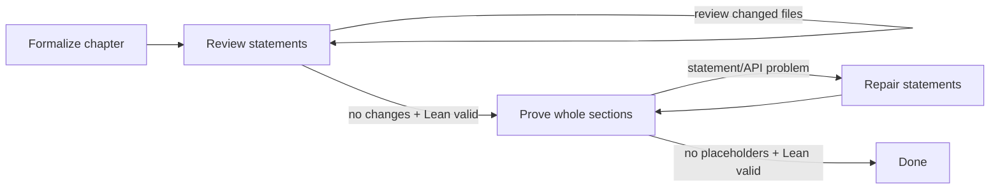

# LastLib Swarm

`lastlib-swarm` orchestrates a large population of noninteractive Codex workers over an informal
mathematics corpus and its Lean translation. It can run one stage from the command line or drive a
resumable, fixed-point pipeline with a live terminal dashboard.



Formalization and review are pipelined per chapter: a chapter can enter review while other chapters
are still being translated. Every chapter in an eligible book can run concurrently. `depends_on`
orders books at statement-review boundaries; independent books run concurrently. Proof work starts
after the selected corpus finishes statement review, then follows the same book DAG while running
each eligible book's chapters in parallel.

For a conventional numbered corpus, point the CLI at the book directory. It discovers all direct
Markdown children and automatically reads `BOOK_DEPENDENCIES.md` from the repository root:

```console
uv run lastlib-swarm plan books/
uv run lastlib-swarm corpus books/
```

Dependency documents use Mermaid edges such as `B01 --> B02 --> B03`; chained edges are expanded.
Pass `--dependencies path/to/graph.md` to select another graph. Dependencies whose books are outside
the selected target set are treated as already satisfied.

## Quick start

The project is managed with [uv](https://docs.astral.sh/uv/). A config file is optional: pass one
informal book Markdown file and LastLib Swarm infers its title, numbered chapters, existing matching
Lean book module, validation commands, and isolated state directory.

```console
uv sync --all-groups
uv run lastlib-swarm plan books/02-finite-extensions-of-local-fields.md
uv run lastlib-swarm books/02-finite-extensions-of-local-fields.md
```

Passing a `.md` as the first argument is shorthand for `pipeline <target>`. Zero-config runs default
to `gpt-5.6-luna`, reasoning effort `max`, the packaged generic prompt library under
`src/lastlib_swarm/prompts/`, automatic execution isolation, and a state directory at
`.swarm/<inferred-book-id>/`. Use
`swarm.example.toml` when the inferred layout is not appropriate or when coordinating multiple books.

Any stage may point at a specialized prompt template. Supported replacement fields include
`{book_title}`, `{chapter_number}`, `{chapter_number_padded}`, `{chapter_title}`, `{source}`,
`{lean_root}`, `{chapter_path}`, `{chapter_module}`, and `{build_command}`.

Codex is invoked in its documented noninteractive JSONL mode with a strict final-report schema. The
default uses the `workspace-write` sandbox and automatic approval review. The much less safe
`bypass_approvals_and_sandbox = true` must be explicitly configured; it is never inferred from the
selected agent count. See OpenAI's official
[Codex non-interactive guidance](https://developers.openai.com/codex/noninteractive).

## Commands

Inspect discovery and configuration without launching agents:

```console
uv run lastlib-swarm plan books/02-finite-extensions-of-local-fields.md
uv run lastlib-swarm plan --config swarm.toml
```

Run an individual stage over the whole configured corpus or a selection:

```console
uv run lastlib-swarm stage formalize books/02-finite-extensions-of-local-fields.md
uv run lastlib-swarm stage review --config swarm.toml --book book02
uv run lastlib-swarm stage prove --config swarm.toml --book book02 --chapter 3
uv run lastlib-swarm stage repair --config swarm.toml --chapter book02/chapter-03
```

Run the complete pipeline:

```console
uv run lastlib-swarm pipeline books/02-finite-extensions-of-local-fields.md
uv run lastlib-swarm corpus books/ --max-agents 24
```

The TUI is the default for stage and pipeline runs. Add `--no-tui` for CI, a process supervisor, or
log-only operation. Add `--force` to rerun tasks already persisted as successful. Without `--force`,
successful stages are resumable and skipped.

Inspect durable status without starting or mutating a run:

```console
uv run lastlib-swarm status books/02-finite-extensions-of-local-fields.md
uv run lastlib-swarm status --config swarm.toml --json
```

`--chapter N` selects that chapter number in every selected book. Use the full chapter id when a
number would be ambiguous.

CLI overrides such as `--model`, `--reasoning-effort`, and `--max-agents` work with both inferred and
configured runs. `--isolation auto|fuse-overlay|shared` selects the execution backend.

## Agent-managed background mode

Managing agents do not need to hold open a TUI or manipulate a background process's stdin. Start a
detached pipeline, then issue one-shot Bash commands over its Unix control socket:

```console
TARGET=books/02-finite-extensions-of-local-fields.md
uv run lastlib-swarm agent start "$TARGET"
uv run lastlib-swarm agent status "$TARGET"
uv run lastlib-swarm agent pause "$TARGET"
uv run lastlib-swarm agent resume "$TARGET"
uv run lastlib-swarm agent snapshot "$TARGET"
uv run lastlib-swarm agent wait "$TARGET"
```

`TARGET=books` manages the inferred corpus through the same detached protocol; the directory and
auto-discovered dependency graph deterministically select a corpus-specific state directory.

Every command prints one JSON object. `wait` blocks until completion and exits with the pipeline's
success/failure code. `snapshot` includes the complete persisted task/run state; `status` is compact.
Use `agent stop` to cancel the scheduler and terminate active Codex/build subprocess groups.

Pause is cooperative: already-running chapter attempts finish, while new agent/build attempts wait at
a checkpoint. This preserves coherent edits and build results. Resume releases all queued work.

For a long-lived managing agent, the `rpc` facade accepts newline-delimited JSON commands on stdin and
returns one JSON response per line:

```console
printf '%s\n' '{"command":"status"}' '{"command":"snapshot"}' \
  | uv run lastlib-swarm agent rpc "$TARGET"
```

Accepted RPC commands are `status`, `snapshot`, `pause`, `resume`, `stop`, and `wait`. The daemon
stores its socket, PID, JSON result, and combined stdout/stderr log under the inferred state directory.
After the daemon exits, `status`, `snapshot`, and `wait` fall back to the persisted offline result.
`agent serve` exposes the same protocol in the foreground for an external process supervisor.

## Fixed-point semantics

- **Formalize** retries until the Codex process returns a structured report and the configured Lean
  validation command succeeds.
- **Review** always uses a fresh agent. It succeeds only when an agent makes no changes inside the
  chapter scope and Lean validation succeeds. A modifying review triggers another independent
  review, up to `max_rounds`.
- **Prove** sends the whole chapter to one agent and explicitly asks for whole-section proof passes
  before batched builds. It succeeds only when the scoped Lean code has no `sorry` or `admit` tokens
  and validation succeeds.
- **Repair** is entered when a proof report identifies a statement/API problem, or when a proof
  agent makes no progress with placeholders remaining. Repair feedback includes the proof report,
  placeholder count, and the tail of the Lean validation output. The pipeline then returns to proof.

The orchestrator independently hashes every configured chapter scope. Agent claims about changes do
not control review convergence. Lean placeholder scanning ignores comments and strings. The strict
agent report is used chiefly to distinguish proof errors from genuine statement repair.

## Multi-book scheduling

The corpus layer validates the book graph as a DAG before launching any agent and reports an explicit
cycle path on failure. It computes a weighted **bottom level** for every book:

```text
rank(book) = effort(book) + max(rank(successor), default=0)
```

Whenever several dependency-ready books compete for a limited agent slot, the scheduler chooses the
largest rank first. This is critical-path list scheduling: it directs capacity toward the longest
remaining dependency chain while still filling spare slots with independent work. It is a heuristic
for parallel machines—not a claim of an optimal schedule for arbitrary runtimes—but it directly
targets critical-path completion and adapts as dependencies unlock.

Effort defaults to the number of selected chapters. Configured corpora can supply positive
`statement_effort` and `proof_effort` values based on historical wall time or expected agent work.
The statement and proof/repair phases have separate ranks, and both enforce book dependencies. The
plan, TUI, persisted snapshot, and agent-control JSON expose the priority order, ranks, and critical
path.

## TUI and token accounting

The dashboard shows:

- aggregate counts for formalize, review, prove, and repair;
- each chapter's status and attempt count in every stage;
- per-chapter cumulative tokens;
- statement/proof critical-path ranks and the current statement critical path;
- measured cumulative input, cached input, output, and reasoning-output tokens.

“API-equivalent tokens” means `input_tokens + output_tokens` from Codex JSONL usage snapshots.
`cached_input_tokens` is displayed separately but is already a subset of input, so it is not added a
second time. Reasoning output is also shown separately and is not double-counted. If a Codex version
does not emit recognized usage fields, the TUI says usage is awaiting measurement rather than
inventing an estimate. This is token accounting, not a currency estimate; model prices and account
billing arrangements are deliberately outside the state model.

## State, logs, and interruption

Configured state defaults to `.swarm/state.json`; inferred single-target state uses
`.swarm/<book-id>/state.json`; inferred corpora use a deterministic
`.swarm/corpus-<id>/state.json`. Raw JSONL agent logs live below `logs/`, with the generated final-report
schema alongside them. Each run records its PID, Codex thread id when emitted, stage, round,
timestamps, scoped-change result, placeholder count, final report, validation tail, and usage. Writes
are atomic.

Press `q` in the TUI or interrupt a headless run to terminate the active child process group. On the
next invocation, interrupted `running` records become `pending` and can resume. Successful records
remain skipped unless `--force` is given.

Agents never commit. With the default `auto` backend, supported Linux systems run each attempt in a
private `fuse-overlayfs` view. The lower generation is an immutable hard-linked snapshot; only files
changed by that attempt occupy its writable upper layer. Codex and validation both run in the merged
view. The coordinator rejects every out-of-scope path, checks that the assigned canonical scope has
not changed since launch, and imports accepted regular files with atomic replacement. A stale writer
is discarded and retried by the normal stage loop.

The number of mounted workspaces is bounded by `max_agents`; slots and upper layers are removed after
each attempt. Generations share unchanged file data through hard links and are removed when their last
reader exits. Temporary mounts live outside the repository so Git discovery and the Codex workspace
sandbox cannot escape through the parent worktree. Package/build trees under `.lake` remain private
overlay writes and are never imported as source changes.

FUSE isolation requires `fuse-overlayfs`, `fusermount3`, `rsync`, an accessible `/dev/fuse`, and the
Codex `workspace-write` sandbox. It deliberately refuses `bypass_approvals_and_sandbox`. `auto`
selects FUSE when these primitives are present and otherwise uses the explicitly visible `shared`
backend; production runs can require isolation with `--isolation fuse-overlay` so missing support is
a hard error. Validation occupies the same global concurrency slot as its agent, keeping large Lean
builds within `max_agents`.

## Configuration

No configuration is required for a conventional numbered LastLib Markdown book. If `swarm.toml`
exists and no target or `--config` is supplied, it is loaded automatically. Explicit top-level
settings override these defaults:

```toml
[swarm]
repo = "."
state_dir = ".swarm"
max_agents = 24
codex_bin = "codex"
model = "gpt-5.6-luna"
reasoning_effort = "max"
sandbox = "workspace-write"
approve_for_me = true
agent_timeout_seconds = 7200
validation_timeout_seconds = 1800
isolation = "auto" # auto, fuse-overlay, or shared
```

Every stage automatically uses its packaged standard prompt and default retry bound. A stage table
may override either setting independently:

```toml
[stages.review]
prompt = "my-prompts/strict-review.md"
max_rounds = 6
```

Books are repeatable. Chapters omitted from `chapters` are discovered from every matching Markdown
heading. Template expansion creates module names, validation commands, and exclusive scopes.

```toml
[[books]]
id = "book03"
title = "Ramification Theory"
source = "books/03-ramification-theory.md"
lean_root = "lean/LastLib/Book03RamificationTheory"
module = "LastLib.Book03RamificationTheory"
depends_on = ["book01", "book02"]
statement_effort = 18.5
proof_effort = 42
chapters = [1, 2, 3]
chapter_path = "Chapter{chapter_number_padded}"
chapter_module = "{module}.Chapter{chapter_number_padded}"
build_command = "cd lean && lake build +{chapter_module}"
scope = [
  "{lean_root}/{chapter_path}.lean",
  "{lean_root}/{chapter_path}/**/*.lean",
]
```

Every `depends_on` id must appear in the same configuration. When a CLI selection excludes an
otherwise configured prerequisite, that prerequisite is treated as pre-existing and satisfied.

## Development checks

Run all required tooling through uv:

```console
uv run ruff format --check .
uv run ruff check .
uv run ty check
uv run pytest
```
