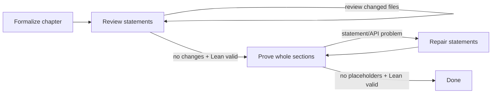

# LastLib Swarm

`lastlib-swarm` orchestrates a large population of noninteractive Codex workers over an informal
mathematics corpus and its Lean translation. It can run one stage from the command line or drive a
resumable, fixed-point pipeline with a live terminal dashboard.



Formalization and review are pipelined per chapter: a chapter can enter review while other chapters
are still being translated. Every chapter in an eligible book can run concurrently. `depends_on`
orders books at statement-review boundaries; independent books run concurrently. Proof work starts
after the selected corpus finishes statement review, then runs chapter-by-chapter in parallel.

## Quick start

The project is managed with [uv](https://docs.astral.sh/uv/):

```console
uv sync --all-groups
cp swarm.example.toml swarm.toml
uv run lastlib-swarm plan --config swarm.toml
uv run lastlib-swarm pipeline --config swarm.toml
```

The checked-in example discovers Book 2's twelve chapter headings and maps them to the existing
LastLib module layout. It reuses `FORMALIZATION_PROMPT.md` for the statement pass and uses the generic
review/prove/repair prompts under `swarm/prompts/`. Any stage may point at a specialized template;
supported replacement fields include `{book_title}`, `{chapter_number}`, `{chapter_number_padded}`,
`{chapter_title}`, `{source}`, `{lean_root}`, `{chapter_path}`, `{chapter_module}`, and
`{build_command}`.

Codex is invoked in its documented noninteractive JSONL mode with a strict final-report schema. The
default uses the `workspace-write` sandbox and automatic approval review. The much less safe
`bypass_approvals_and_sandbox = true` must be explicitly configured; it is never inferred from the
selected agent count. See the official [Codex CLI command reference](https://developers.openai.com/codex/cli/reference).

## Commands

Inspect discovery and configuration without launching agents:

```console
uv run lastlib-swarm plan --config swarm.toml
```

Run an individual stage over the whole configured corpus or a selection:

```console
uv run lastlib-swarm stage formalize --config swarm.toml
uv run lastlib-swarm stage review --config swarm.toml --book book02
uv run lastlib-swarm stage prove --config swarm.toml --book book02 --chapter 3
uv run lastlib-swarm stage repair --config swarm.toml --chapter book02/chapter-03
```

Run the complete pipeline:

```console
uv run lastlib-swarm pipeline --config swarm.toml
```

The TUI is the default for stage and pipeline runs. Add `--no-tui` for CI, a process supervisor, or
log-only operation. Add `--force` to rerun tasks already persisted as successful. Without `--force`,
successful stages are resumable and skipped.

Inspect durable status without starting or mutating a run:

```console
uv run lastlib-swarm status --config swarm.toml
uv run lastlib-swarm status --config swarm.toml --json
```

`--chapter N` selects that chapter number in every selected book. Use the full chapter id when a
number would be ambiguous.

## Fixed-point semantics

- **Formalize** retries until the Codex process returns a structured report and the configured Lean
  validation command succeeds.
- **Review** always uses a fresh agent. It succeeds only when an agent makes no changes inside the
  chapter scope and Lean validation succeeds. A modifying review triggers another independent
  review, up to `max_rounds`.
- **Prove** sends the whole chapter to one agent and explicitly asks for whole-section proof passes
  before batched builds. It succeeds only when the scoped Lean code has no `sorry` or `admit` tokens
  and validation succeeds.
- **Repair** is entered when a proof report identifies a statement/API problem, or when a proof
  agent makes no progress with placeholders remaining. Repair feedback includes the proof report,
  placeholder count, and the tail of the Lean validation output. The pipeline then returns to proof.

The orchestrator independently hashes every configured chapter scope. Agent claims about changes do
not control review convergence. Lean placeholder scanning ignores comments and strings. The strict
agent report is used chiefly to distinguish proof errors from genuine statement repair.

## TUI and token accounting

The dashboard shows:

- aggregate counts for formalize, review, prove, and repair;
- each chapter's status and attempt count in every stage;
- per-chapter cumulative tokens;
- measured cumulative input, cached input, output, and reasoning-output tokens.

“API-equivalent tokens” means `input_tokens + output_tokens` from Codex JSONL usage snapshots.
`cached_input_tokens` is displayed separately but is already a subset of input, so it is not added a
second time. Reasoning output is also shown separately and is not double-counted. If a Codex version
does not emit recognized usage fields, the TUI says usage is awaiting measurement rather than
inventing an estimate. This is token accounting, not a currency estimate; model prices and account
billing arrangements are deliberately outside the state model.

## State, logs, and interruption

State defaults to `.swarm/state.json`, with raw JSONL agent logs in `.swarm/logs/` and the generated
final-report schema alongside them. Each run records its PID, Codex thread id when emitted, stage,
round, timestamps, scoped-change result, placeholder count, final report, validation tail, and usage.
Writes are atomic.

Press `q` in the TUI or interrupt a headless run to terminate the active child process group. On the
next invocation, interrupted `running` records become `pending` and can resume. Successful records
remain skipped unless `--force` is given.

Agents never commit. They share the orchestrator's worktree, so chapter scopes must be disjoint for
safe parallel writes. Validation occupies the same global concurrency slot as its agent, which keeps
large Lean builds within `max_agents` rather than creating an unbounded second swarm.

## Configuration

Top-level settings:

```toml
[swarm]
repo = "."
state_dir = ".swarm"
max_agents = 24
codex_bin = "codex"
model = "gpt-5.6-luna"
reasoning_effort = "max"
sandbox = "workspace-write"
approve_for_me = true
agent_timeout_seconds = 7200
validation_timeout_seconds = 1800
```

Every stage needs a prompt and may set its own retry bound:

```toml
[stages.review]
prompt = "swarm/prompts/review.md"
max_rounds = 6
```

Books are repeatable. Chapters omitted from `chapters` are discovered from every matching Markdown
heading. Template expansion creates module names, validation commands, and exclusive scopes.

```toml
[[books]]
id = "book03"
title = "Ramification Theory"
source = "books/03-ramification-theory.md"
lean_root = "lean/LastLib/Book03RamificationTheory"
module = "LastLib.Book03RamificationTheory"
depends_on = ["book01", "book02"]
chapters = [1, 2, 3]
chapter_path = "Chapter{chapter_number_padded}"
chapter_module = "{module}.Chapter{chapter_number_padded}"
build_command = "cd lean && lake build +{chapter_module}"
scope = [
  "{lean_root}/{chapter_path}.lean",
  "{lean_root}/{chapter_path}/**/*.lean",
]
```

Every `depends_on` id must appear in the same configuration. When a CLI selection excludes an
otherwise configured prerequisite, that prerequisite is treated as pre-existing and satisfied.

## Development checks

Run all required tooling through uv:

```console
uv run ruff format --check .
uv run ruff check .
uv run ty check
uv run pytest
```
