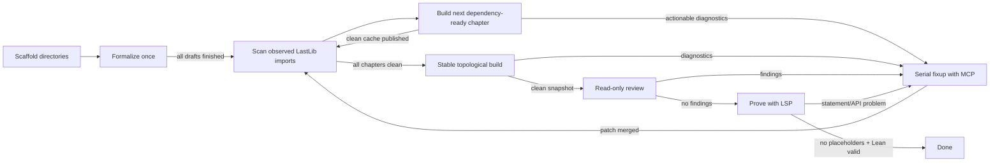

# LastLib Swarm

`lastlib-swarm` orchestrates a large population of noninteractive Codex workers over an informal
mathematics corpus and its Lean translation. It combines an optimistic parallel drafting pass with
coordinator-driven build convergence, MCP-backed fixup, read-only mathematical review, and
LSP-backed proving.

Install `ripgrep` and ensure its `rg` executable is on `PATH` before starting a large swarm. Agents
use it for fast source and declaration searches. Worker-launching commands continue without it, but
print a prominent warning in headless/background mode or retain a warning banner in the TUI because
fallback searches can be substantially slower.



Scaffolding is deterministic and creates directories only. Formalization then runs once for every
missing chapter scope without Lean or LSP validation, so chapters and books can draft concurrently
despite provisional imports. After all drafts finish, the coordinator discovers chapter edges with
regexes over the current `import LastLib...` lines. It then fixes one dependency-ready chapter at a
time with Lean MCP, rescans imports after every accepted patch, and rebuilds and publishes the cache
before continuing. A final graph-stable topological build establishes the immutable baseline used by
review and proof. Reviewers do not edit it; fixup and proof agents receive Lean MCP.

For a conventional numbered corpus, point the CLI at the book directory. It discovers all direct
Markdown children and automatically reads `BOOK_DEPENDENCIES.md` from the repository root:

```console
uv run lastlib-swarm plan books/
uv run lastlib-swarm corpus books/
```

Dependency documents use Mermaid edges such as `B01 --> B02 --> B03`; chained edges are expanded.
Pass `--dependencies path/to/graph.md` to select another graph. Dependencies whose books are outside
the selected target set are treated as already satisfied.

## Quick start

The project is managed with [uv](https://docs.astral.sh/uv/). A config file is optional: pass one
informal book Markdown file and LastLib Swarm infers its title, numbered chapters, existing matching
Lean book module, validation commands, and isolated state directory.

```console
uv sync --all-groups
uv run lastlib-swarm plan books/02-finite-extensions-of-local-fields.md
uv run lastlib-swarm books/02-finite-extensions-of-local-fields.md
```

Passing a `.md` as the first argument is shorthand for `pipeline <target>`. Zero-config runs default
to `gpt-5.6-luna`, reasoning effort `max`, the packaged generic prompt library under
`src/lastlib_swarm/prompts/`, automatic execution isolation, and a state directory at
`.swarm/<inferred-book-id>/`. Proof attempts attach a private Lean LSP MCP server; drafting, fixup,
and review do not. Use
`swarm.example.toml` when the inferred layout is not appropriate or when coordinating multiple books.

Any stage may point at a specialized prompt template. Supported replacement fields include
`{book_title}`, `{chapter_number}`, `{chapter_number_padded}`, `{chapter_title}`, `{source}`,
`{lean_root}`, `{chapter_path}`, `{chapter_module}`, and `{build_command}`.

The final agent prompt is composed from three deliberately separate layers: the selected stage
template defines its mission and workflow, packaged `prompts/common.md` defines shared mathematical
and import policy, and the generated runtime contract supplies the exact scope, MCP availability,
coordinator-owned build behavior, and structured-report requirements. Shared policy belongs in the
common layer rather than being copied into every stage template.

Proof agents must clear every MCP warning except “declaration uses `sorry`” for a theorem they
attempted but could not prove. Disabling a linter or warning option is not an acceptable fix.

Codex is invoked in its documented noninteractive JSONL mode with a strict final-report schema.
Swarm workers default to `--dangerously-bypass-approvals-and-sandbox`, giving them full host access
for unattended formalization. Set `bypass_approvals_and_sandbox = false` and
`approve_for_me = true` to restore automatic review with Codex's workspace-write sandbox. See
OpenAI's official
[Codex non-interactive guidance](https://developers.openai.com/codex/noninteractive).

Transient model-capacity failures resume the same Codex thread with capped exponential backoff.
After the configured retries are exhausted, the worker releases its concurrency slot and its chapter
is requeued as a fresh attempt behind waiting formalizers. A failed chapter does not cancel unrelated
formalizers; the pipeline finishes the remaining drafting work before reporting failure.

## Commands

Inspect discovery and configuration without launching agents:

```console
uv run lastlib-swarm plan books/02-finite-extensions-of-local-fields.md
uv run lastlib-swarm plan --config swarm.toml
```

Run an individual stage over the whole configured corpus or a selection:

```console
uv run lastlib-swarm stage formalize books/02-finite-extensions-of-local-fields.md
uv run lastlib-swarm stage fixup books/02-finite-extensions-of-local-fields.md
uv run lastlib-swarm stage review --config swarm.toml --book book02
uv run lastlib-swarm stage prove --config swarm.toml --book book02 --chapter 3
```

Create the deterministic directory scaffold without launching Codex:

```console
uv run lastlib-swarm scaffold books/02-finite-extensions-of-local-fields.md
```

Run the complete pipeline:

```console
uv run lastlib-swarm pipeline books/02-finite-extensions-of-local-fields.md
uv run lastlib-swarm corpus books/ --max-agents 24
```

The TUI is the default for stage and pipeline runs. Add `--no-tui` for CI, a process supervisor, or
log-only operation. Add `--force` to rerun tasks already persisted as successful. Without `--force`,
successful stages are resumable and skipped.

Inspect durable status without starting or mutating a run:

```console
uv run lastlib-swarm status books/02-finite-extensions-of-local-fields.md
uv run lastlib-swarm status --config swarm.toml --json
```

Inspect the accumulated informal-textbook issue ledger:

```console
uv run lastlib-swarm source-issues books/02-finite-extensions-of-local-fields.md
uv run lastlib-swarm source-issues --config swarm.toml --json
```

Every agent report has a structured `source_issues` field. Genuine textbook defects are recorded
with a precise location, exact identifying excerpt, mathematical explanation, and minimal suggested
replacement. The coordinator enriches each sighting with book, chapter, stage, and run provenance,
deduplicates repeated sightings, and persists the ledger at `.swarm/.../source-issues.json` as well
as in the state snapshot. Detection does not stop an agent: it must make the principled accommodation
allowed by its stage and continue through all unaffected work. The ledger is evidence for a later
reviewed textbook patch; swarm workers do not rewrite the Markdown automatically.

`--chapter N` selects that chapter number in every selected book. Use the full chapter id when a
number would be ambiguous.

CLI overrides such as `--model`, `--reasoning-effort`, and `--max-agents` work with both inferred and
configured runs. `--isolation auto|fuse-overlay|shared` selects the execution backend.

Use `--no-lean-mcp` to run the proof stage without the Lean MCP integration.

## Lean LSP MCP proof loop

Every proof attempt receives its own locked
[`lean-lsp-mcp`](https://github.com/oOo0oOo/lean-lsp-mcp) stdio server, rooted inside the agent's
private FUSE overlay. It exposes whole-file diagnostics, outlines, hover and declaration lookup,
local source search, proof goals, completions, code actions, and batched tactic trials. Remote search,
local Loogle, and the MCP's `lean_build` tool remain absent from the allowlist.

Proof agents first read and attempt the entire assigned file set without checking each speculative
proof separately. They then request whole-file diagnostics and iterate only over failing proofs and
their dependent declarations. Agents never invoke a compiler. After an agent exits, the coordinator
terminates its MCP/LSP process group, merges accepted scoped changes into the main worktree, and
enqueues one targeted `lake build +Module`. Merge and build form one serialized transaction, and the
main worktree's `.lake` is the only writable build cache. The coordinator rejects a successful
compiler exit if its captured output contains any warning other than the exact “declaration uses
`sorry`” diagnostic. This check reuses the targeted build and does not launch a second compiler.

An MCP/LSP process exists per active proof attempt, not per queued agent. Its imported `.olean` files come
from a read-only snapshot of the coordinator cache taken when the attempt starts, while its document
state remains private. No new attempt snapshot is created during a merge/build transaction, so it
cannot pair newly merged sources with stale artifacts. Consequently `max_agents` also bounds the
number of concurrent Lean language servers.

## Agent-managed background mode

Managing agents do not need to hold open a TUI or manipulate a background process's stdin. Start a
detached pipeline, then issue one-shot Bash commands over its Unix control socket:

```console
TARGET=books/02-finite-extensions-of-local-fields.md
uv run lastlib-swarm agent start "$TARGET"
uv run lastlib-swarm agent status "$TARGET"
uv run lastlib-swarm agent pause "$TARGET"
uv run lastlib-swarm agent resume "$TARGET"
uv run lastlib-swarm agent unblock "$TARGET"
uv run lastlib-swarm agent snapshot "$TARGET"
uv run lastlib-swarm agent inspect "$TARGET" --chapter 8
uv run lastlib-swarm agent inspect "$TARGET" --chapter book02/chapter-08 --follow
uv run lastlib-swarm agent wait "$TARGET"
```

`TARGET=books` manages the inferred corpus through the same detached protocol; the directory and
auto-discovered dependency graph deterministically select a corpus-specific state directory.

Every command prints one JSON object. `wait` blocks until completion and exits with the pipeline's
success/failure code. `snapshot` includes the complete persisted task/run state; `status` is compact.
Use `agent stop` to cancel the scheduler and terminate active Codex/build subprocess groups.

Pause is cooperative: already-running chapter attempts finish, while new agent/build attempts wait at
a checkpoint. This preserves coherent edits and build results. Resume releases all queued work.
`unblock` resets every persisted `blocked` task to `pending` without deleting its run history. It can
be issued against either a live daemon or offline state; pending tasks are eligible the next time the
corresponding stage is scheduled.

For a long-lived managing agent, the `rpc` facade accepts newline-delimited JSON commands on stdin and
returns one JSON response per line:

```console
printf '%s\n' '{"command":"status"}' '{"command":"snapshot"}' \
  | uv run lastlib-swarm agent rpc "$TARGET"
```

Accepted RPC commands are `status`, `snapshot`, `pause`, `resume`, `unblock`, `stop`, `wait`, and
`inspect`.
Inspection requests may include `chapter` or `run`, for example
`{"command":"inspect","chapter":"book02/chapter-08"}`. The daemon
stores its socket, PID, JSON result, and combined stdout/stderr log under the inferred state directory.
After the daemon exits, `status`, `snapshot`, and `wait` fall back to the persisted offline result.
`agent serve` exposes the same protocol in the foreground for an external process supervisor.

## Fixed-point semantics

- **Scaffold** deterministically creates the configured chapter directories and no Lean files.
- **Formalize** skips a materialized chapter scope or runs exactly one optimistic drafting agent.
  Drafts are merged without agent-side Lean. Each completed scope immediately becomes eligible for
  targeted coordinator builds instead of waiting for the entire corpus to finish drafting.
- **Fixup** groups targeted-build failures by chapter ownership and appends them verbatim to parallel
  fixup prompts. A failure mentioning a scope whose formalizer is still active is deferred rather
  than assigned prematurely. Completed scopes cycle through build and fixup while other drafts run;
  after drafting drains, a full-corpus build/fixup loop establishes global cleanliness. This repeats
  up to `max_rounds`, allowing `declaration uses sorry` but rejecting other warnings.
- **Review** runs read-only agents against one clean source and `.olean` generation. Findings are
  returned as structured reports, routed through fixup, rebuilt, and reviewed again until no
  actionable finding remains.
- **Prove** sends the whole chapter to one agent, asks for one complete proof-writing pass, and then
  uses whole-file LSP diagnostics to focus iterations on failed proofs. It succeeds only when the
  scoped Lean code has no `sorry` or `admit` tokens and final Lake validation succeeds without any
  warning other than “declaration uses `sorry`”.
- A proof agent may change proof bodies but not declaration interfaces. A genuine statement/API
  problem is reported with `needs_fixup`; the pipeline returns through fixup and read-only review
  before proving resumes.

The orchestrator independently hashes every configured chapter scope. Agent claims about changes do
not control review convergence. Lean placeholder scanning ignores comments and strings. The strict
agent report distinguishes ordinary proof errors from genuine statement fixup requests.

## Multi-book scheduling

The corpus layer validates the book graph as a DAG before launching any agent and reports an explicit
cycle path on failure. It computes a weighted **bottom level** for every book:

```text
rank(book) = effort(book) + max(rank(successor), default=0)
```

Whenever several dependency-ready books compete for a limited agent slot, the scheduler chooses the
largest rank first. This is critical-path list scheduling: it directs capacity toward the longest
remaining dependency chain while still filling spare slots with independent work. It is a heuristic
for parallel machines—not a claim of an optimal schedule for arbitrary runtimes—but it directly
targets critical-path completion and adapts as dependencies unlock.

Effort defaults to the number of selected chapters. Configured corpora can supply positive
`statement_effort` and `proof_effort` values based on historical wall time or expected agent work.
Ranks prioritize competition for agent slots; optimistic drafting is not dependency-gated. The plan,
TUI, persisted snapshot, and agent-control JSON expose the priority order, ranks, and critical path.

## TUI and token accounting

The dashboard shows:

- the live-agent total against `max_agents`, broken down by stage, plus attempts waiting for a slot;
- the active coordinator build's mode, iteration, target progress, and current chapter;
- chapter-stage phases (`queued`, `building`, `agent`, and `awaiting rebuild`) separately from
  terminal stage status;
- aggregate chapter counts for formalize, fixup, review, and prove;
- each chapter's status and attempt count in every stage;
- per-chapter tokens for the current invocation;
- statement/proof critical-path ranks and the current statement critical path;
- each running agent's current command, MCP call, edit, or reasoning state and failure count;
- measured cumulative input, cached input, output, and reasoning-output tokens.

Select a chapter row and press Enter (or `i`) to open its agent detail screen. It updates while the
agent runs and has tabs for the compact event timeline, Codex todo plan, touched files, and bounded
raw JSONL events. The header includes PID/thread id, elapsed and idle time, shell/MCP/edit counts,
complete latest agent update in a scrollable pane, latest substantive error, and measured per-run
spend. Bare process statuses such as `exit 2` are retained in the event timeline but are not promoted
to latest or systemic errors. The detail pane reports tokens and API-equivalent cost for that exact
agent attempt, and the overview-only Inspect action is hidden there. Press Escape or `q` to return
to the swarm overview. Repeated equivalent failures across agents produce a deduplicated systemic
alert in the overview instead of requiring inspection of every chapter.

Codex JSONL, state, activity, and control messages are decoded with `orjson`. Live JSONL is still
framed incrementally rather than loaded as a whole file. Dashboard cells and static cards are updated
only when their values change, and the raw-event tab tails newly appended bytes instead of reparsing
the log on every refresh.

The token count means `input_tokens + output_tokens`. The primary dashboard and CLI total is for
attempts started by the current swarm invocation; a separately labelled lifetime total includes
every persisted attempt in this state directory, including failed and cancelled attempts. Both views
also show the corresponding API-equivalent dollar cost for the model recorded on each attempt.
Legacy attempts created before model persistence are priced as `gpt-5.6-luna`.
`cached_input_tokens` is displayed separately but is already a subset of input, so it is not added a
second time. Reasoning output is also shown separately and is not double-counted.

Codex's stdout JSONL normally reports authoritative usage only when a turn completes. Once Codex
reports a thread id, the orchestrator also tails that thread's local rollout token-count events and
atomically checkpoints its latest cumulative usage into the run record. Cancellation stops the
process, drains the rollout once more, and preserves that partial spend. The final stdout usage, when
available, updates the same record. If a Codex version does not emit recognized usage fields in
either stream, the TUI says usage is awaiting measurement rather than inventing an estimate.

## State, logs, and interruption

Configured state defaults to `.swarm/state.json`; inferred single-target state uses
`.swarm/<book-id>/state.json`; inferred corpora use a deterministic
`.swarm/corpus-<id>/state.json`. Raw JSONL agent logs live below `logs/`, with the generated final-report
schema alongside them. Compact `*.activity.json` sidecars retain the most recent event timeline and
health counters without copying large command output into pipeline state. An attempt record is
written atomically before its workspace is acquired or Codex is launched. Each run records its PID,
Codex thread id when emitted, stage, round, timestamps, scoped-change result, placeholder count,
final report, validation tail, and incrementally checkpointed usage. Task records separately persist
their current queue/build/agent phase, while a coordinator-build record tracks the single serialized
Lake build. Running run records—not chapter-stage records—are the authoritative live-agent count.
Writes are atomic.

Press `q` in the TUI or interrupt a headless run to terminate the active child process group. On the
next invocation, interrupted `running` records become `pending` and can resume. Successful records
remain skipped unless `--force` is given. The TUI drains its workers and unmounts their overlays
before exiting. Shutdown waits briefly for the complete Codex process group and force-terminates
surviving MCP/LSP descendants before unmounting; the next invocation also reclaims any mounts left
by a hard-killed orchestrator.

Agents never commit. With the default `auto` backend, supported Linux systems run each attempt in a
private `fuse-overlayfs` view. Each view has two immutable lower generations: a source snapshot that
excludes `.lake`, and a read-only snapshot of the coordinator's `.lake`. Only files changed by that
attempt occupy its writable upper layer. Codex and its private LSP run in the merged view; validation
never does. The coordinator rejects every out-of-scope source path, checks that the assigned
canonical scope has not changed since launch, and imports accepted regular files with atomic
replacement. A stale writer is
discarded and retried by the normal stage loop.

The number of mounted workspaces is bounded by `max_agents`; slots and upper layers are removed after
each attempt. Generations share unchanged file data through hard links and are removed when their last
reader exits. Temporary mounts live outside the repository so Git discovery starts from the private
view.

All proof agents pinned to a cache generation share the same Lake artifact inodes and OS page-cache
pages; the snapshot is never copied once per agent. A clean global fixup build publishes the
read-only baseline used by review and proof. Reopening a file through the proof MCP gives Lean's LSP
one dependency-build pass; resulting cache writes occupy only that agent's writable upper layer and
are discarded at teardown. The generic MCP build remains hidden. Already-running proof agents remain
pinned to their original clean snapshot, while later attempts see coordinator-published artifacts.
Old snapshots are reclaimed when their last agent exits, and source imports preserve mtimes.

FUSE isolation requires `fuse-overlayfs`, `fusermount3`, `rsync`, and an accessible `/dev/fuse`.
`auto` selects FUSE when these primitives are present and otherwise uses the explicitly visible
`shared` backend; production runs can require isolation with `--isolation fuse-overlay` so missing
support is a hard error. The fallback `shared` backend serializes complete attempts because source
edits cannot otherwise be isolated from coordinator builds. With full-access Codex workers,
overlays prevent ordinary cwd-relative
collisions and still gate imported changes, but they are not a security boundary: a worker can use
absolute paths to reach the canonical repository or other host files. Enable the Codex sandbox when
that boundary must be enforced. Validation remains associated with the completed agent's global
slot, while the independent build queue guarantees that at most one Lake build runs at a time.

## Configuration

No configuration is required for a conventional numbered LastLib Markdown book. If `swarm.toml`
exists and no target or `--config` is supplied, it is loaded automatically. Explicit top-level
settings override these defaults:

```toml
[swarm]
repo = "."
state_dir = ".swarm"
max_agents = 24
codex_bin = "codex"
model = "gpt-5.6-luna"
reasoning_effort = "max"
sandbox = "workspace-write"
approve_for_me = false
bypass_approvals_and_sandbox = true
agent_timeout_seconds = 7200
capacity_resume_attempts = 10 # resume the same Codex thread after transient capacity failures
capacity_resume_delay_seconds = 15 # initial delay; doubles after each failure
capacity_resume_max_delay_seconds = 120 # cap for exponential backoff
validation_timeout_seconds = 1800
isolation = "auto" # auto, fuse-overlay, or shared
lean_mcp = true
lean_project = "lean" # relative to swarm.repo; contains lakefile and lean-toolchain
lean_mcp_tool_timeout_seconds = 300
```

Every stage automatically uses its packaged standard prompt and default retry bound. A stage table
may override either setting independently:

```toml
[stages.fixup]
max_rounds = 12

[stages.review]
prompt = "my-prompts/strict-review.md"
max_rounds = 6
```

Books are repeatable. Chapters omitted from `chapters` are discovered from every matching Markdown
heading. Template expansion creates module names, validation commands, and exclusive scopes.

```toml
[[books]]
id = "book03"
title = "Ramification Theory"
source = "books/03-ramification-theory.md"
lean_root = "lean/LastLib/Book03RamificationTheory"
module = "LastLib.Book03RamificationTheory"
depends_on = ["book01", "book02"]
statement_effort = 18.5
proof_effort = 42
chapters = [1, 2, 3]
chapter_path = "Chapter{chapter_number_padded}"
chapter_module = "{module}.Chapter{chapter_number_padded}"
build_command = "cd lean && lake build +{chapter_module}"
scope = [
  "{lean_root}/{chapter_path}.lean",
  "{lean_root}/{chapter_path}/**/*.lean",
]
```

Every `depends_on` id must appear in the same configuration. When a CLI selection excludes an
otherwise configured prerequisite, that prerequisite is treated as pre-existing and satisfied.

## Development checks

Run all required tooling through uv:

```console
uv run ruff format --check .
uv run ruff check .
uv run ty check
uv run pytest
```
