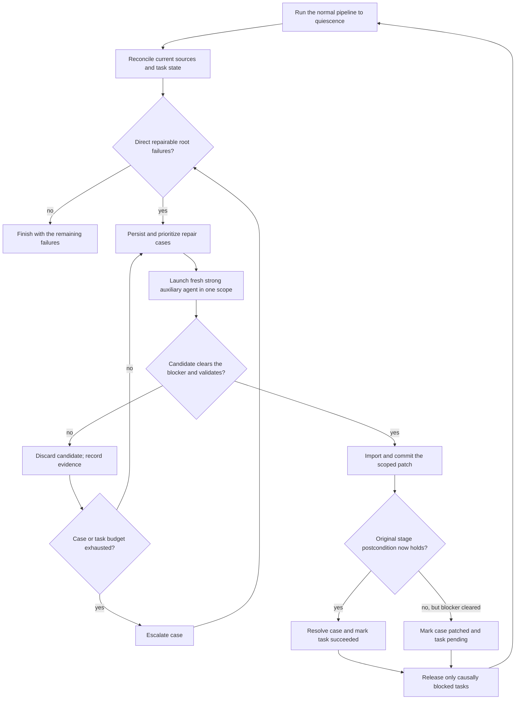

# Quiescent repair sweeps

Status: proposed

## Summary

Large swarms eventually produce a small set of failures that ordinary bounded retries do not
resolve: an agent repeatedly follows the wrong proof idea, leaves a malformed interface, misunderstands
an import boundary, or reports completion without fixing the diagnostic that caused the retry. PAF
should be able to spend a small, explicit budget on a stronger model to repair those exceptional
cases.

The recommended design is a **quiescent repair sweep**. After the normal scheduler has drained all
work it can do, a recovery controller identifies direct, locally repairable root failures. It creates
durable repair cases and launches a fresh, stronger agent for each selected work-unit scope. The agent
receives the exact blocker and bounded history from the failed task, works in the same isolation and
scope regime as an ordinary agent, and returns a stage-specific structured report. PAF accepts a
repair only when its own checks show that the named blocker is gone and the candidate introduces no
new validation failure.

This is deliberately not one omnipotent agent with write access to the whole repository. “Sweep” is
the scheduling abstraction; a repair attempt is still isolated to one existing exclusive scope. This
keeps commits, stale-writer detection, chapter locks, validation, restart behavior, and causal
unblocking understandable.

Repair should be an auxiliary run role, not a fifth pipeline stage. The normal stage remains the
owner of its completion predicate, and successful work still rejoins the ordinary fixed point.

## Goals

- Recover a useful fraction of terminal, source-local failures with a stronger model.
- Give the repair agent enough exact evidence to avoid repeating the failed agents' approaches.
- Never repair a downstream symptom when an earlier root task is the actual blocker.
- Preserve PAF's exclusive scopes, stage write policies, Git history, and coordinator validation.
- Bound cost and churn across both loops and orchestrator restarts.
- Make every decision and attempt inspectable in durable state and the UI.
- Degrade to an ordinary failed run when repair is disabled, ineligible, unavailable, or exhausted.

## Non-goals

- Repairing invalid `paf.toml`, a cyclic source graph, missing credentials, a broken toolchain, or a
  PAF implementation bug by editing project files.
- Letting an agent expand its own write scope.
- Replacing the targeted upstream proof-request protocol. An escalated upstream request may
  eventually become input to a repair case, but its existing request/answer/targeted-retry invariants
  remain authoritative.
- Retrying every failed process with a more expensive model. Capacity errors, interruption,
  stale-writer conflicts, and other operational failures already have deterministic recovery paths.
- Treating an agent's claim that it fixed something as proof that it did.

## Core invariants

1. A repair is associated with one direct root failure and one exclusive work-unit scope.
2. Derived failed or blocked tasks are impact information, not repair targets.
3. A repair agent always starts a fresh Codex thread. Only transient capacity/resource recovery may
   resume that repair thread.
4. Repair runs use the existing per-work-unit lock and count against a small, separate repair
   concurrency limit as well as the global safety limits.
5. The stage's ordinary write policy still applies. In particular, proof repair cannot change
   declaration interfaces, and discovery remains read-only.
6. Candidate edits are validated before they are imported when transactional isolation is
   available. Out-of-scope, stale, or regressing candidates are discarded.
7. Only coordinator code changes task, dependency, request, or repair-case state.
8. An auxiliary repair failure never recursively creates another repair case.
9. Attempts are capped by a stable failure fingerprint and by task lineage, so restarting PAF cannot
   reset the budget.
10. Repair never weakens a validator, suppresses a warning, adds a placeholder, or edits the build
    configuration to make the failure disappear.

## Lifecycle



The first implementation should trigger only after a complete normal scheduling wave. That gives
ordinary retries and specialized proof handoffs the first opportunity, produces a stable failure
set, and avoids a repair agent racing work that was already going to fix the problem. A future
component-level trigger could start a sweep when one dependency component is quiescent, but it is
not needed initially.

## Record failures as data

Today a terminal task mostly has a status and human-readable `detail`. That is useful to an operator
but too fragile for automatic recovery. Every transition to `failed` or `blocked` should also create
a typed `TaskFailure` and attach its id to the task:

```text
TaskFailure
  id
  task_key, stage
  code                    # stable producer-owned code
  class                   # source_local, contract, dependency, operational, configuration, ...
  direct                  # false for a propagated failure/block
  caused_by_failure_ids
  run_ids
  blocker                 # typed, mechanically re-checkable BlockerSpec
  source_digest
  config_fingerprint
  created_at, cleared_at
```

`BlockerSpec` is the important part. It records what PAF can check again, rather than only prose:

- diagnostic identities and owning paths for a failed build;
- declaration names and before/after placeholder counts for a stalled proof;
- finding/request ids that a review failed to assess;
- invalid or missing fields for an agent-report contract failure;
- unknown work-unit ids for discovery;
- an escalated upstream-request id and the exact unclosed consumer declaration.

Dependency propagation should link to the original failure id. For example, a review that cannot run
because formalization failed is a derived block caused by the formalization failure; it is not a
second candidate. This also removes the need for recovery code to infer causality from strings such
as “formalization did not complete.”

Suggested top-level failure classes and default dispositions are:

| Class                   | Examples                                                    | Automatic repair                                       |
| ----------------------- | ----------------------------------------------------------- | ------------------------------------------------------ |
| Source-local            | persistent Lean diagnostics, proof stall, incomplete review | yes                                                    |
| Agent contract          | no usable report after the stage's normal retry policy      | yes, if a stage acceptance check exists                |
| Specialized escalation  | exhausted upstream proof request                            | manual initially; eligible later through that protocol |
| Dependency              | blocked by another task                                     | never directly; follow the cause                       |
| Concurrency             | stale writer, dirty exclusive scope                         | deterministic retry, not strong-model repair           |
| Operational             | timeout, capacity, descriptor pressure, unavailable model   | existing retry policy or operator action               |
| Configuration/toolchain | graph cycle, invalid mapping, missing Lake project          | operator action                                        |
| Interruption            | orchestrator stopped                                        | existing resume behavior                               |

Failure codes, not classes alone, determine eligibility. Adding a new automatic code should require
both a dossier renderer and a blocker verifier.

## Durable repair cases

The recovery controller groups current direct failures by `(scope owner, stage, source digest)` and
upserts a `RepairCase`:

```text
RepairCase
  id, fingerprint
  target_task_key
  failure_ids
  state                   # open, patched, resolved, escalated, superseded
  source_digest_before
  config_fingerprint
  blocked_task_keys       # impact only
  attempt_run_ids
  attempt_count
  lineage_count
  patch_commit, patched_source_digest
  resolution_run_id
  last_error
  created_at, updated_at
```

The fingerprint should hash the task key, stable failure code, normalized blocker identities,
source digest, relevant request/finding ids, and configuration fingerprint. It must not hash volatile
timestamps, truncated log text, or attempt numbers.

There is intentionally no durable `running` case state. A running or interrupted auxiliary
`RunRecord(role="failure_repair", request_ids=[case_id])` is the in-flight fact, just as ordinary
agent runs are the authority for live-agent counts. Completed case states remain simple facts:

- `open`: the current failure still needs an attempt;
- `patched`: an accepted patch cleared this blocker, but normal stage work remains;
- `resolved`: the original stage postcondition holds;
- `escalated`: the bounded automatic policy could not safely resolve it;
- `superseded`: the relevant source/configuration or blocker changed before this case ran.

The attempt count increments when the run row is durably created, not when the agent returns. A hard
kill therefore cannot create free retries. An explicit operator command may reopen an escalated case
without deleting its history.

## Candidate selection and priority

Before spending model capacity, PAF should reconcile each apparent root failure against current
sources. Another accepted edit may already have removed the diagnostic, supplied the declaration, or
made the exact build fresh. Such a case is resolved without an agent.

The remaining cases are eligible only when:

- the failure is direct and its code has a registered verifier;
- its source and configuration fingerprints still match;
- no ordinary run or specialized upstream repair is active for the same work unit;
- the case, task, lineage, sweep, and optional cost budgets all permit another attempt;
- the isolation backend can provide the required safety guarantees.

Default priority should favor the root with the greatest downstream impact, using the existing
critical-path rank and the count of causally blocked tasks, with age as a tie-breaker. A default
repair concurrency of one is intentional: failures are rare, the model is expensive, and each
successful patch can invalidate the dossiers of other cases. If configured above one, PAF may run
only cases with disjoint scopes and no dependency relation concurrently.

## The repair dossier

The prompt should contain a bounded, generated dossier rather than an unbounded concatenation of
JSONL logs. It should include:

- work-unit identity, source span, target scope, stage, and exact write policy;
- the typed root failure and exact `BlockerSpec`;
- the current source/configuration digests and Git revision;
- the latest exact Lean diagnostics, residual goals, finding ids, or schema errors;
- a compact ledger of the last few primary attempts: model, report summary, reported issues,
  validation output, changed paths, commit, and materially different attempted approaches;
- related proof-review or upstream-request records;
- the causal list of tasks blocked by this root, clearly marked as context rather than write scope;
- references to full local logs for operator inspection, without assuming the sandbox can read an
  external `state_dir`.

Exact blockers must be retained even when older narrative history is truncated. The dossier should
quote agent-produced and source-produced text as untrusted evidence and keep runtime instructions in
a separate final section.

The repair prompt should tell the agent to:

1. reproduce or directly inspect the named blocker before editing;
2. compare its proposed approach with the failed-attempt ledger;
3. make the smallest principled in-scope fix that removes the blocker;
4. preserve the original stage's semantic and interface policy;
5. leave unrelated placeholders and chapters alone;
6. report an exact out-of-scope owner instead of working around a cause elsewhere;
7. finish with the stage-specific report plus repair metadata.

The extra report metadata should include `diagnosis`, `blocker_status` (`cleared`,
`not_reproduced`, `external`, or `unresolved`), approaches not repeated, changed declarations, and
any proposed handoff. These fields aid audit and later attempts; the coordinator does not trust
`blocker_status` without running the registered verifier.

## Execution profile, not stage

Adding `Stage.REPAIR` would create a synthetic task for every work unit, complicate the dependency
graph, and blur which postcondition actually succeeded. Instead, add a role-specific execution
profile:

```text
ExecutionProfile
  role = "failure_repair"
  model, reasoning_effort, timeout
  prompt template and report-schema selector
  tool policy
```

`CodexExecutor.command` should resolve model and reasoning settings from the execution profile, while
the run retains the failed task's real stage. The run is auxiliary, does not consume the task's
ordinary round count, records the actual stronger model for pricing, and is never selected as the
session to resume for an ordinary stage attempt.

Repair schemas should extend the relevant stage schema rather than replace it. A discovery repair
still returns dependencies; a review repair still assesses every supplied finding; a proof repair
still reports failed declarations and upstream requests. This lets existing stage acceptance logic
remain authoritative.

## Validate before integration

Automatic repair deserves stricter integration semantics than an ordinary exploratory proof round.
For the FUSE backend, split workspace collection into preview and import:

1. Preview the exact overlay delta and reject any out-of-scope path.
2. Check stage-specific invariants in the private candidate workspace.
3. Run the registered blocker verifier against the candidate.
4. Run the standard Lean validation for the affected work unit and required import descendants.
5. Under the source lock, confirm the base generation is still current.
6. Import the already-validated bytes, create one scoped Conventional Commit, and persist its SHA and
   resulting digest on the case.
7. Publish or refresh coordinator build artifacts through the normal build queue.

The repair commit should use a subject such as
`fix(book07): repair blocked proof in chapter 4` and include a `PAF-Repair-Case: <id>` trailer. The
trailer and source digest make the small Git/database crash window reconcilable.

The initial automatic feature should require transactional FUSE isolation. The shared backend edits
the canonical tree during the attempt and cannot reliably discard a rejected candidate. In shared
mode, `paf repair` may offer an explicit operator-driven mode with the existing semantics, but an
automatic sweep should stop with a clear “transactional isolation required” disposition rather than
silently taking weaker guarantees.

Candidate acceptance is stage-specific:

| Stage     | Blocker-cleared check                                                                                                    | Completion check                                   |
| --------- | ------------------------------------------------------------------------------------------------------------------------ | -------------------------------------------------- |
| Discover  | valid, known, acyclic dependency report; no source edits                                                                 | ordinary discovery persistence succeeds            |
| Formalize | recorded diagnostics are absent and candidate build is clean                                                             | ordinary formalize clean-build predicate           |
| Review    | required finding ids are assessed; edited closure is clean                                                               | ordinary review `complete` and rebuild predicate   |
| Prove     | named declaration is placeholder-free or placeholder count strictly decreases; declaration-interface digest is unchanged | zero placeholders and ordinary proof certification |

If the exact blocker is cleared and the candidate is clean but the whole stage is not complete, PAF
may import the patch, mark the case `patched`, and return the original task to `pending`. If the
blocker remains or a new diagnostic appears, it discards the candidate. This distinction lets a
repair agent remove one genuinely hard proof obstruction without requiring it to finish every
unrelated placeholder.

An out-of-scope diagnosis does not authorize an edit. Initially it should escalate with the proposed
owner and evidence. Later, PAF may create a linked case for that owner only when path ownership and
dependency direction are deterministic; the second case must have its own scope, lock, fingerprint,
budget, validation, and commit.

## Rejoining the normal fixed point

Resolving or patching a case clears its root failure. PAF then resets only tasks whose current causal
blocker set is now empty:

- the repaired task becomes `succeeded` if its stage predicate was certified, otherwise `pending`;
- causally blocked dependents become `pending` when all of their causes are resolved;
- unrelated failed tasks and manual escalations remain untouched;
- successful tasks are not force-rerun merely because a repair sweep occurred;
- run history and ordinary round counts are retained.

The normal scheduler then runs another wave. Repair dossiers are recomputed only after that wave
quiesces, so a patch that changes imports or diagnostics cannot leave stale queued cases behind.

The outer loop is bounded:

```text
run normal wave
while pipeline is incomplete and repair_sweeps < max_sweeps:
    reconcile failures
    select bounded eligible root cases
    run repairs
    if no case was resolved or patched: break
    run another normal wave
```

## Configuration and controls

The feature should ship disabled by default until the manual workflow has accumulated evidence. A
proposed configuration is:

```toml
[repair]
enabled = true
trigger = "after-wave" # or "manual"
model = "gpt-5.6-sol"
reasoning_effort = "xhigh"
max_agents = 1
max_sweeps = 2
max_cases_per_sweep = 8
max_attempts_per_case = 1
max_attempts_per_task = 2
max_lineage_depth = 2
agent_timeout_seconds = 7200
# max_cost_usd = 50.0                # optional soft launch budget
require_transactional_isolation = true
```

All limits except `max_sweeps` are enforced from durable history, not just process memory. A soft
cost budget prevents new launches after completed measured spend reaches the limit; the attempt and
task caps remain the hard bound when usage is unavailable.

Useful commands are:

- `paf repair TARGET --plan` to show root cases, eligibility, impact, and the evidence fingerprint
  without launching an agent;
- `paf repair TARGET [--case ID]` to run the bounded manual sweep;
- `paf repair TARGET --retry CASE_ID` to explicitly reopen one escalated case;
- a daemon `repair` control command with the same selection semantics.

`--force` should not erase repair budgets. `unblock` should retain its current meaning for blocked
tasks and specialized upstream requests; reopening an exhausted repair case must remain a separate,
explicit action.

## Persistence and crash recovery

The database should add normalized `task_failures` and `repair_cases` tables, while keeping compact
current failure/case summaries in task and dashboard projections. Startup reconciliation handles
each crash boundary idempotently:

- case persisted, no run: it remains `open`;
- live repair run after shutdown: the run becomes `interrupted`, the case remains `open`, and a later
  sweep starts a fresh repair thread while still counting the attempt;
- agent finished, no imported patch: replay collection only if the isolated workspace is known safe;
  otherwise record the interrupted attempt and retry within budget;
- commit exists but case update is missing: find the case trailer, verify the recorded candidate
  digest, and continue stage certification without launching another agent;
- task succeeded but case update is missing: reconcile the stage predicate and mark the case
  `resolved`;
- source or config no longer matches: mark the old case `superseded` and classify the current failure
  afresh.

No recovery path should infer success solely from a completed Codex report.

## Observability

The TUI, web UI, status JSON, and final failure summary should expose:

- open, running (derived from runs), patched, resolved, escalated, and superseded case counts;
- repair model, usage, cost, elapsed time, and attempt budget;
- root failure code and exact blocker summary;
- number and critical-path weight of blocked dependents;
- candidate changed paths, validation result, commit, and why it was accepted or discarded;
- explicit ineligibility or escalation reason.

Repair activity should appear in the existing run timeline with role `failure_repair`, but it should
not inflate the ordinary stage round count. Aggregate spend should include it normally and allow a
repair-only breakdown.

## Rollout plan

1. **Typed failures.** Add stable failure codes, causal links, blocker specs, database persistence,
   and a read-only `paf repair --plan`. Convert all current terminal scheduler paths before enabling
   selection; do not fall back to parsing `detail`.
2. **Manual single-case repair.** Add the execution profile, stage-extended schemas, repair prompt,
   FUSE preview/validation/import path, case ledger, and `paf repair --case`. Support source-local
   formalize and prove failures first, where the acceptance predicates are strongest.
3. **Review and discovery.** Add their report-contract verifiers and stage-specific acceptance tests.
4. **Automatic quiescent sweeps.** Wrap the normal pipeline in the bounded outer fixed point, add
   causal unblocking and priority selection, and expose controls/metrics. Keep the feature opt-in.
5. **Evaluate before broadening.** Measure resolved-case rate, discarded candidates, regressions,
   cost per resolved root, and repeated fingerprints. Only then consider automatic handling of
   escalated upstream requests or component-level early triggering.

## Required tests

- Every terminal producer emits a stable failure code and a re-checkable blocker or is explicitly
  ineligible.
- Derived failures collapse to one root case and are released only when all causes clear.
- Fingerprints are stable across restart and change when relevant source, configuration, findings,
  or diagnostics change.
- An out-of-scope, stale-generation, interface-changing proof, warning-suppressing, or
  still-failing candidate is discarded without changing the canonical tree.
- A clean partial proof repair is committed, marks the case `patched`, and resumes ordinary proof
  work; a complete one resolves the task without another agent.
- Repair runs use the configured model, fresh thread, role-specific schema, separate concurrency,
  and normal token accounting.
- Capacity exhaustion, cancellation, and hard kills at each persistence boundary cannot create free
  attempts or duplicate commits.
- Restart reconciliation covers the commit-before-case-update and task-success-before-case-update
  windows.
- Repeated restarts, changed failure fingerprints, and repair-caused follow-on failures still obey
  per-case, per-task, lineage, sweep, and cost bounds.
- The automatic mode refuses shared isolation, while the plan command remains available.
- Existing targeted upstream repair, `--resume`, `--force`, `unblock`, and successful-task skipping
  retain their current semantics.

## Why this shape

A single repository-wide fixer is appealing because it can see every failure at once, but it would
need broad write access, would race active work, and would make it difficult to attribute validation
or roll back one bad judgment. Conversely, simply retrying the original stage with a larger model
does not distinguish root causes, carries forward weak failure evidence, and can loop across
restarts.

Quiescent sweeps get the useful global view at selection time while retaining local transactions at
execution time. Typed blockers make the decision deterministic; the stronger model supplies the
diagnosis and patch; PAF remains responsible for scope, causality, validation, durability, and the
definition of success.
