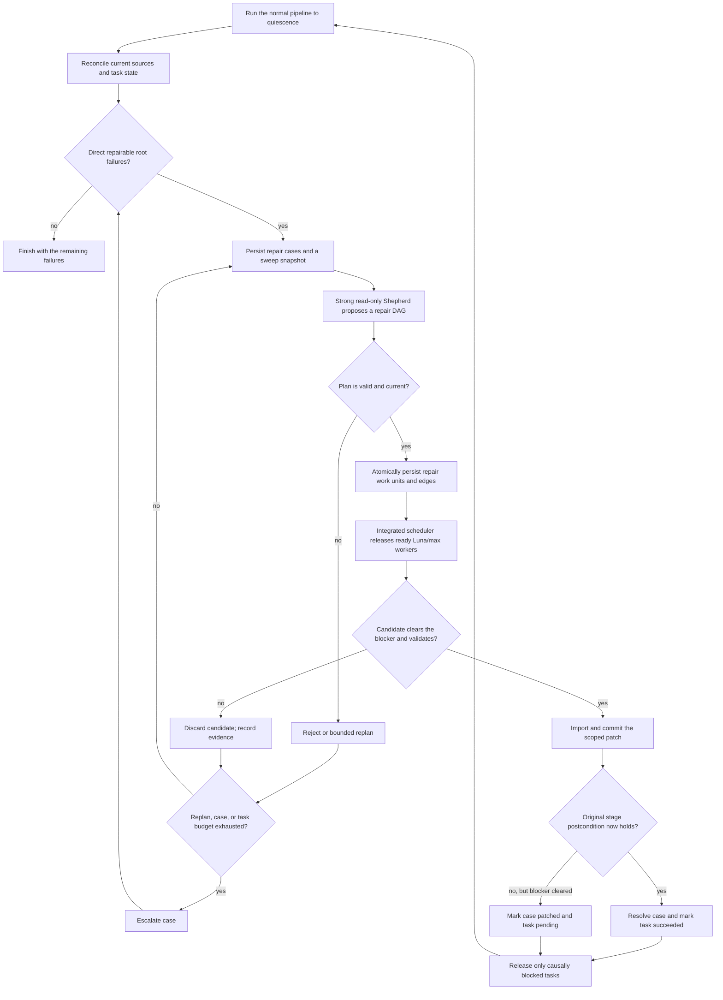
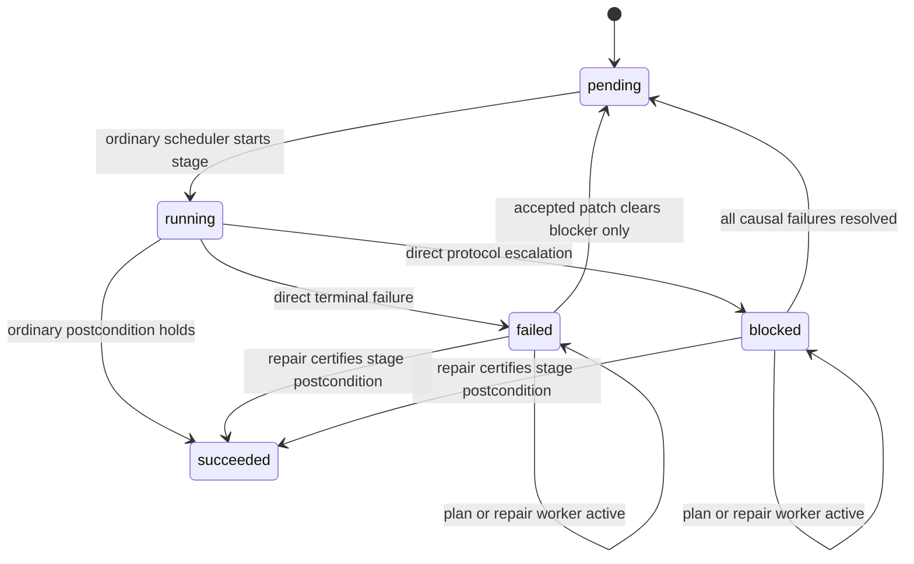
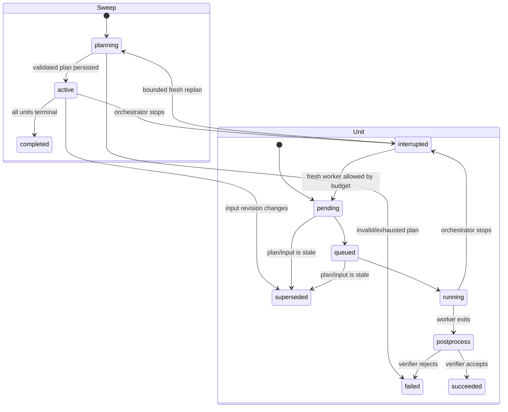

# Shepherd repair sweeps

Status: core implementation landed; typed failure causality and manual controls remain future work

## Summary

Large swarms eventually produce a small set of failures that ordinary bounded retries do not
resolve: an agent repeatedly follows the wrong proof idea, leaves a malformed interface,
misunderstands an import boundary, or reports completion without fixing the diagnostic that caused
the retry. PAF should be able to spend a small, explicit budget on a stronger model to understand
and schedule those exceptional cases without paying strong-model prices for every edit.

The implemented design is a **Shepherd repair sweep** with two model tiers. At most once every two
hours by default, a recovery controller identifies locally repairable failures. Once that cooldown
has elapsed, either the interval or the configured failure threshold can trigger a sweep. One
read-only strong-model Shepherd receives the failure dossier and emits a small,
structured DAG of repair work units. Ordinary Luna/max workers execute those units in their
individual scopes. PAF accepts a repair only when its own checks show that the candidate validates.

The Shepherd may group failures, identify an earlier owner, order repair units, and recommend an
effort bucket, but it cannot edit files or assign arbitrary scheduler priorities. Each editing unit
is still isolated to one existing exclusive scope. This keeps commits, stale-writer detection,
chapter locks, validation, restart behavior, and causal unblocking understandable.

Repair uses auxiliary run roles, not a fifth pipeline stage. The normal stage remains the owner of
its completion predicate, and successful work still rejoins the ordinary fixed point.

## Implementation status

The current implementation persists `ShepherdRecord`, `RepairCaseRecord`, `RepairSweepRecord`, and
`RepairWorkUnitRecord` in the global checkpoint; validates all Shepherd ids, stages, case coverage,
and dependency cycles; inherits successor effort into repair priority; and schedules workers through
the existing chapter locks, stage capacity, isolation, Git, and coordinator-build paths. A running
unit overlays `repairing` on its exact owner/stage task cell without changing that task's underlying
status. When the coordinator build begins validation, that cell switches to `building`. The TUI and
web dashboard expose Shepherd state and repair counts.

The stricter typed `TaskFailure`/`BlockerSpec` causality model, normalized repair tables, cost budgets,
manual repair commands, and commit trailers described below are the hardening roadmap. Until those
land, case fingerprints use the task status/detail plus latest run and validation evidence.

## Goals

- Use a stronger model where global diagnosis, decomposition, and ordering have the most leverage.
- Execute actual edits with the normal Luna/max worker profile.
- Give repair workers enough exact evidence to avoid repeating the failed agents' approaches.
- Never repair a downstream symptom when an earlier root task is the actual blocker.
- Preserve PAF's exclusive scopes, stage write policies, Git history, and coordinator validation.
- Bound cost and churn across both loops and orchestrator restarts.
- Make every decision and attempt inspectable in durable state and the UI.
- Degrade to an ordinary failed run when repair is disabled, ineligible, unavailable, or exhausted.

## Non-goals

- Repairing invalid `paf.toml`, a cyclic source graph, missing credentials, a broken toolchain, or a
  PAF implementation bug by editing project files.
- Letting an agent expand its own write scope.
- Replacing the targeted upstream proof-request protocol. An escalated upstream request may
  eventually become input to a repair case, but its existing request/answer/targeted-retry invariants
  remain authoritative.
- Retrying every failed process with a more expensive model. Capacity errors, interruption,
  stale-writer conflicts, and other operational failures already have deterministic recovery paths.
- Treating an agent's claim that it fixed something as proof that it did.

## Core invariants

1. Each repair work unit is associated with at least one direct root failure and exactly one existing
   exclusive work-unit scope.
2. Derived failed or blocked tasks are impact information, not repair targets.
3. The Shepherd is read-only. Its output is a proposal that must pass a deterministic plan
   validator before it changes scheduling state.
4. Every Shepherd and repair worker starts a fresh Codex thread. Only transient capacity/resource
   recovery may resume that same thread.
5. Repair workers use the existing per-work-unit lock and count against the target stage's agent
   pool. The Shepherd has a separate concurrency limit of one and never holds a source lock.
6. The stage's ordinary write policy still applies. In particular, proof repair cannot change
   declaration interfaces, and discovery remains read-only.
7. Candidate edits are validated before they are imported when transactional isolation is
   available. Out-of-scope, stale, or regressing candidates are discarded.
8. Only PAF code changes task, dependency, request, repair-case, or repair-work-unit state. The model
   cannot invent a scope, verifier, or unbounded numeric priority.
9. An auxiliary repair failure never recursively creates another repair case. It may provide
   evidence for one bounded strong-model replan.
10. Attempts are capped by a stable failure fingerprint and by task lineage, so restarting PAF cannot
    reset the budget.
11. Repair never weakens a validator, suppresses a warning, adds a placeholder, or edits the build
    configuration to make the failure disappear.

## Lifecycle



The implementation invokes the Shepherd from a live periodic/threshold loop. A threshold sweep is
also checked when a scheduling wave finishes, so a batch of failures cannot disappear with process
shutdown before planning. Once a repair plan is validated, its work units join the same
dependency-aware scheduler as the four ordinary stages for the lifetime of that orchestrator.
Unfinished plans are discarded on restart and regenerated from current root failures.

## Record failures as data

Today a terminal task mostly has a status and human-readable `detail`. That is useful to an operator
but too fragile for automatic recovery. Every transition to `failed` or `blocked` should also create
a typed `TaskFailure` and attach its id to the task:

```text
TaskFailure
  id
  task_key, stage
  code                    # stable producer-owned code
  class                   # source_local, contract, dependency, operational, configuration, ...
  direct                  # false for a propagated failure/block
  caused_by_failure_ids
  run_ids
  blocker                 # typed, mechanically re-checkable BlockerSpec
  source_digest
  config_fingerprint
  created_at, cleared_at
```

`BlockerSpec` is the important part. It records what PAF can check again, rather than only prose:

- diagnostic identities and owning paths for a failed build;
- declaration names and before/after placeholder counts for a stalled proof;
- finding/request ids that a review failed to assess;
- invalid or missing fields for an agent-report contract failure;
- unknown work-unit ids for discovery;
- an escalated upstream-request id and the exact unclosed consumer declaration.

Dependency propagation should link to the original failure id. For example, a review that cannot run
because formalization failed is a derived block caused by the formalization failure; it is not a
second candidate. This also removes the need for recovery code to infer causality from strings such
as “formalization did not complete.”

Suggested top-level failure classes and default dispositions are:

| Class                   | Examples                                                    | Automatic repair                                       |
| ----------------------- | ----------------------------------------------------------- | ------------------------------------------------------ |
| Source-local            | persistent Lean diagnostics, proof stall, incomplete review | yes                                                    |
| Agent contract          | no usable report after the stage's normal retry policy      | yes, if a stage acceptance check exists                |
| Specialized escalation  | exhausted upstream proof request                            | manual initially; eligible later through that protocol |
| Dependency              | blocked by another task                                     | never directly; follow the cause                       |
| Concurrency             | stale writer, dirty exclusive scope                         | deterministic retry, not strong-model repair           |
| Operational             | timeout, capacity, descriptor pressure, unavailable model   | existing retry policy or operator action               |
| Configuration/toolchain | graph cycle, invalid mapping, missing Lake project          | operator action                                        |
| Interruption            | orchestrator stopped                                        | existing resume behavior                               |

Failure codes, not classes alone, determine eligibility. Adding a new automatic code should require
both a dossier renderer and a blocker verifier.

## Durable repair cases

The recovery controller groups current direct failures by `(scope owner, stage, source digest)` and
upserts a `RepairCase`:

```text
RepairCase
  id, fingerprint
  target_task_key
  failure_ids
  state                   # open, planned, patched, resolved, escalated, superseded
  source_digest_before
  config_fingerprint
  blocked_task_keys       # impact only
  sweep_ids, repair_work_unit_ids
  worker_attempt_count
  lineage_count
  patch_commits, patched_source_digests
  resolution_run_ids
  last_error
  created_at, updated_at
```

The fingerprint should hash the task key, stable failure code, normalized blocker identities,
source digest, relevant request/finding ids, and configuration fingerprint. It must not hash volatile
timestamps, truncated log text, or attempt numbers.

There is intentionally no durable `running` case state. Running or interrupted Shepherd and
worker runs, together with repair work-unit state, are the in-flight facts and the authority for
live-agent counts. Case states remain simple aggregate facts:

- `open`: the current failure still needs a valid plan;
- `planned`: at least one current repair work unit is pending or active;
- `patched`: an accepted patch cleared this blocker, but normal stage work remains;
- `resolved`: the original stage postcondition holds;
- `escalated`: the bounded automatic policy could not safely resolve it;
- `superseded`: the relevant source/configuration or blocker changed before this case ran.

Worker attempt counts increment when run rows are durably created, not when agents return. Planner
run and replan counts are tracked separately on the sweep. A hard kill therefore cannot create free
retries. An explicit operator command may reopen an escalated case without deleting its history.

## Shepherd and repair work units

One strong-model Shepherd plans a bounded batch of cases. It is a read-only orchestration run,
not a worker attached to a source task. Its input snapshot contains the current failures, causal
links, ordinary stage states, source and import graphs, critical-path ranks, prior attempts, scopes,
and registered blocker verifiers. Its structured `RepairPlan` must account for every selected case
with either repair work or an explicit disposition.

The plan may:

- combine compatible blockers owned by the same existing work-unit scope;
- split one complicated failure into ordered repair work units;
- identify a deterministic earlier owner and put its unit before a consumer unit;
- describe the objective and evidence packet for each Luna worker;
- choose a small effort bucket and explain which normal tasks the unit should unblock;
- declare a failure ineligible or request operator review.

The plan may not create a source scope, validator, stage, absolute priority, or unrestricted shell
task. PAF validates all model-supplied ids against current state, copies scope from the existing owner
rather than from model output, rejects cycles, checks chronological owner constraints, clamps effort
buckets, requires overlapping units to be explicitly ordered, and requires every terminal success
criterion to name a registered `BlockerSpec` verifier. Every planned case must have exactly one
terminal repair unit, every other unit for that case must reach it, and orphan units are rejected. The
whole plan is rejected if any unit is invalid; partial model output never becomes scheduler state.

The durable entities are:

```text
RepairSweep
  id, state, snapshot_revision, plan_digest
  case_ids, shepherd_run_ids
  plan_attempt_count, replan_count
  created_at, updated_at

RepairWorkUnit
  id, sweep_id, case_ids
  terminal_for_case_ids
  owner_work_unit_id, target_stage
  objective, evidence_refs
  blocker_ids, verifier_ids
  depends_on_repair_unit_ids
  effort_bucket, priority_rationale
  source_digest, config_fingerprint
  status, phase, queued
  worker_run_ids, patch_commits
  created_at, updated_at
```

`RepairWorkUnit` is intentionally distinct from the corpus `WorkUnit`. It is a dynamic recovery job
over one corpus work unit, not a new source chapter. Its `target_stage` selects the existing prompt
contract, tools, pool, validation, and write policy. Multiple scopes always become multiple repair
work units, even if the Shepherd considers them one mathematical fix.

## Eligibility and planning trigger

Before spending model capacity, PAF should reconcile each apparent root failure against current
sources. Another accepted edit may already have removed the diagnostic, supplied the declaration, or
made the exact build fresh. Such a case is resolved without invoking the Shepherd.

The remaining cases are eligible only when:

- the failure is direct and its code has a registered verifier;
- its source and configuration fingerprints still match;
- no ordinary run or specialized upstream repair is active for the same scope;
- the case, repair-unit, task, lineage, sweep, and optional cost budgets all permit more work;
- the isolation backend can provide the required safety guarantees.

The first version batches eligible roots every configured interval or, after the same cooldown has
elapsed, when enough new fingerprints reach the failure threshold. The Shepherd is invoked only if
at least one eligible fingerprint is available.
A bounded replan may run after a worker supplies genuinely new evidence or a valid plan becomes stale;
an ordinary worker failure alone does not recursively create a new case.

## Priority relative to the four stages

Repair work is not a fifth stage and does not get a global “repair first” override. Instead, PAF adds
the validated repair units to an **augmented execution DAG** containing the existing stage nodes for
each corpus work unit:

```text
discover(u) -> formalize(u) -> review(u) -> prove(u)
```

The actual graph retains today's source-formalization dependencies, first-review dependencies,
targeted re-review exceptions, and proof release rules. For each case, PAF—not the model—adds an edge
from its validated terminal repair unit to the failed stage node it is intended to unblock:

```text
repair(owner, i) -> retry-or-certify(failed-stage(u)) -> existing downstream stage nodes
```

Coordinator-planned dependencies add edges only between repair units. While those units are pending,
the failed ordinary task remains terminal and cannot also launch a normal worker. Once the last
required repair unit succeeds, the ordinary task is either certified or returned to `pending`.

If a repair unit targets an earlier owner rather than the failed consumer, the owner's ordinary task
record remains in its current state; the repair unit is an auxiliary overlay and takes the owner's
work-unit lock. Accepted statement/API edits use the existing freshness and review invalidation
rules. A downstream repair unit cannot become ready until those invalidations and any explicit repair
dependencies are satisfied.

Use the same bottom-level calculation already used for corpus scheduling over the augmented graph:

```text
rank(node) = bounded_effort(node) + max(rank(successor), default=0)
```

Ordinary nodes retain PAF's configured statement/proof effort and historical estimates; the model
does not replace them. The Shepherd chooses only a named `small`, `medium`, or `large` repair effort
bucket. PAF maps that bucket to a bounded value and combines it with the owner's existing schedule.

This gives the desired cross-stage behavior without a brittle stage-wide precedence rule:

- an upstream formalization repair that releases many reviews and proofs normally outranks an
  unrelated leaf proof;
- a leaf proof repair does not jump ahead of critical-path discovery or formalization merely because
  it is repair work;
- two repair units inherit the downstream value of the normal stage nodes they unblock;
- the Shepherd's effort bucket influences the unit's own bounded cost estimate, but cannot
  overwhelm the dependency-derived rank.

Normal and repair nodes compete by descending rank, then by oldest ready time and stable id. No
running agent is preempted. A unit targeting discovery uses the discovery pool and remains read-only;
units targeting formalize, review, or prove share the existing mutating `agent_slots` pool. A worker
must acquire both the repair-worker limiter and its target-stage pool, so repair concurrency is an
additional cap rather than extra edit capacity. The Shepherd uses a separate one-slot
planning limiter, is included in live-agent and cost accounting, and never occupies a work-unit lock.
Coordinator builds continue through the existing serialized build queue.

Once a plan is persisted, ready repair units run by augmented rank. Accepted repairs reset only their
covered failures to `pending`, and a scheduling wave that observed repair progress runs the ordinary
stage graph again.

## Shepherd dossier and worker packets

The Shepherd receives one bounded sweep dossier rather than an unbounded concatenation of
JSONL logs. It should include:

- all selected case ids, work-unit identities, source spans, stages, and exact write policies;
- the typed root failure and exact `BlockerSpec`;
- the current source/configuration digests and Git revision;
- the latest exact Lean diagnostics, residual goals, finding ids, or schema errors;
- a compact ledger of the last few primary attempts: model, report summary, reported issues,
  validation output, changed paths, commit, and materially different attempted approaches;
- related proof-review or upstream-request records;
- the causal list of tasks blocked by each root and their current augmented-graph ranks;
- references to full local logs for operator inspection, without assuming the sandbox can read an
  external `state_dir`.

Exact blockers must be retained even when older narrative history is truncated. The dossier should
quote agent-produced and source-produced text as untrusted evidence and keep runtime instructions in
a separate final section. The Shepherd sees scope metadata but has a read-only sandbox and no
editing tools.

After plan validation, PAF renders a smaller worker packet for each repair unit. It contains only the
unit's objective, owner scope, prerequisite results, exact blockers and verifiers, relevant attempt
ledger, and the original stage contract. The Luna/max worker should:

1. reproduce or directly inspect the named blocker before editing;
2. compare its proposed approach with the failed-attempt ledger;
3. make the smallest principled in-scope fix that removes the blocker;
4. preserve the original stage's semantic and interface policy;
5. leave unrelated placeholders and chapters alone;
6. report an exact out-of-scope owner instead of working around a cause elsewhere;
7. finish with the stage-specific report plus repair metadata.

The worker's extra report metadata should include `diagnosis`, `blocker_status` (`cleared`,
`not_reproduced`, `external`, or `unresolved`), approaches not repeated, changed declarations, and
any proposed handoff. These fields aid audit and later replans; PAF does not trust
`blocker_status` without running the registered verifier.

## Execution profiles, not a stage

Adding `Stage.REPAIR` would create a synthetic task for every work unit, complicate the dependency
graph, and blur which postcondition actually succeeded. Instead, add two role-specific execution
profiles:

```text
ExecutionProfile
  role = "shepherd" | "repair_worker"
  model, reasoning_effort, timeout, sandbox
  prompt template and report-schema selector
  tool policy
```

The Shepherd profile uses the stronger model and a read-only sandbox. Its auxiliary run anchors its
history to one selected work unit while `ShepherdRecord.current_run_id` exposes its global identity.
The worker profile defaults to
`gpt-5.6-luna` with `max` reasoning and inherits the repair unit's `target_stage`. Its run is attached
to the repair work unit and owner task, is auxiliary, and does not consume the task's ordinary round
count. Both runs record their actual models for separate cost accounting and are never selected as
the session to resume for an ordinary stage attempt.

The Shepherd has one strict `RepairPlan` schema. Workers reuse the relevant stage schema
rather than replace it: a discovery worker still returns dependencies, a review worker still assesses
every supplied finding, and a proof worker still reports failed declarations and upstream requests.
This lets existing stage acceptance logic remain authoritative while keeping the expensive model out
of the editing path.

## Validate before integration

Automatic repair deserves stricter integration semantics than an ordinary exploratory proof round.
For the FUSE backend, split workspace collection into preview and import:

1. Preview the exact overlay delta and reject any out-of-scope path.
2. Check stage-specific invariants in the private candidate workspace.
3. Run the registered blocker verifier against the candidate.
4. Run the standard Lean validation for the affected work unit and required import descendants.
5. Under the source lock, confirm the base generation is still current.
6. Import the already-validated bytes, create one scoped Conventional Commit, and persist its SHA and
   resulting digest on the case.
7. Publish or refresh coordinator build artifacts through the normal build queue.

The repair commit should use a subject such as
`fix(book07): repair blocked proof in chapter 4` and include a `PAF-Repair-Case: <id>` trailer for
each case it serves. The trailers and source digest make the small Git/database crash window
reconcilable.

The initial automatic feature should require transactional FUSE isolation. The shared backend edits
the canonical tree during the attempt and cannot reliably discard a rejected candidate. In shared
mode, `paf repair` may offer an explicit operator-driven mode with the existing semantics, but an
automatic sweep should stop with a clear “transactional isolation required” disposition rather than
silently taking weaker guarantees.

Candidate acceptance is stage-specific:

| Stage     | Blocker-cleared check                                                                                                    | Completion check                                   |
| --------- | ------------------------------------------------------------------------------------------------------------------------ | -------------------------------------------------- |
| Discover  | valid, known, acyclic dependency report; no source edits                                                                 | ordinary discovery persistence succeeds            |
| Formalize | recorded diagnostics are absent and candidate build is clean                                                             | ordinary formalize clean-build predicate           |
| Review    | required finding ids are assessed; edited closure is clean                                                               | ordinary review `complete` and rebuild predicate   |
| Prove     | named declaration is placeholder-free or placeholder count strictly decreases; declaration-interface digest is unchanged | zero placeholders and ordinary proof certification |

If the exact blocker is cleared and the candidate is clean but the whole stage is not complete, PAF
may import the patch, mark the case `patched`, and return the original task to `pending`. If the
blocker remains or a new diagnostic appears, it discards the candidate. This distinction lets a
Luna/max repair worker remove one genuinely hard proof obstruction without requiring it to finish
every unrelated placeholder.

An out-of-scope diagnosis does not authorize an edit. Initially it should escalate with the proposed
owner and evidence. Later, PAF may create a linked case for that owner only when path ownership and
dependency direction are deterministic; the second case must have its own scope, lock, fingerprint,
budget, validation, and commit.

## Linked state machines

The existing task state machine should not gain a `repair` stage or a `repairing` terminal status.
The direct task remains `failed` (or directly `blocked`) while its recovery overlay is active, so the
original fact is not lost and the normal scheduler cannot launch a competing worker. Dashboard
projections may render this as “failed · repair planned/running.”



Repair sweeps and their dynamic work units have separate state machines:



Case state is the durable aggregate across sweeps: `open` before a valid plan, `planned` while a
current unit is pending or active, `patched` after a blocker-clearing partial repair, `resolved` after
stage certification, and `escalated` or `superseded` at the corresponding terminal decisions. Live
`planning`, `running`, and `verifying` labels are derived from sweep, unit, and run records instead of
being separately mutable case facts.

State changes occur at explicit transactional boundaries:

1. A task terminal transition and its typed `TaskFailure` are persisted together.
2. Eligible cases and the sweep snapshot revision are persisted before the Shepherd starts.
3. A valid plan inserts all repair units and dependency edges and marks its cases `planned` in one
   transaction. Until that commit, none of the units is schedulable.
4. A repair unit is marked `running` and its Luna worker `RunRecord` is inserted before acquiring a
   workspace.
5. Candidate verification updates the unit, case, patch commit, original task, and newly unblocked
   causal dependents in one state batch after source integration.
6. If the plan's source/configuration revision is stale, pending units become `superseded`; running
   units still face generation checks at import and cannot publish stale edits.

A failed repair unit is retained as evidence. A bounded replan creates new unit ids rather than
mutating the failed objective in place, which keeps the plan and attempt history auditable.

A repair unit whose owner differs from the root task never changes the owner's task to `running`.
The unit and auxiliary run carry that activity. Accepted owner edits may independently reopen the
owner's or its descendants' ordinary build/review state through the existing invalidation machinery.

## Rejoining the normal fixed point

Resolving or patching a case clears its root failure. PAF then resets only tasks whose current causal
blocker set is now empty:

- the repaired task becomes `succeeded` if its stage predicate was certified, otherwise `pending`;
- causally blocked dependents become `pending` when all of their causes are resolved;
- unrelated failed tasks and manual escalations remain untouched;
- successful tasks are not force-rerun merely because a repair sweep occurred;
- run history and ordinary round counts are retained.

The integrated scheduler then runs another wave over the augmented graph. The Shepherd's
sweep dossier is recomputed only after that wave quiesces, so a patch that changes imports or
diagnostics cannot leave stale planned units behind.

The outer loop is bounded:

```text
run normal wave
while pipeline is incomplete and repair_sweeps < max_sweeps:
    reconcile failures
    run one strong-model coordination pass for bounded eligible root cases
    validate and persist its repair work-unit DAG
    run ready Luna/max repair and ordinary work to quiescence by augmented rank
    if no case was resolved or patched: break
```

## Configuration and controls

The feature ships enabled by default. Its current configuration is:

```toml
[shepherd]
enabled = true
model = "gpt-5.6-sol"
reasoning_effort = "medium"
worker_model = "gpt-5.6-luna"
worker_reasoning_effort = "max"
interval_seconds = 7200
failure_threshold = 10
maximum_failures_per_sweep = 50
maximum_work_units_per_sweep = 32
maximum_consecutive_no_progress_sweeps = 3
max_agents = 2
```

Projects can set `enabled = false` to opt out.

The worker profile is independent of the Shepherd profile and defaults to Luna/max even when the
Shepherd uses a stronger model. Consecutive no-progress sweeps are bounded; progress or new failure
fingerprints reset the backoff. Completed case/work-unit history remains durable across restarts,
but an unfinished plan does not.

Planned manual controls are:

- `paf repair TARGET --candidates` to show deterministic root cases, eligibility, impact, and
  fingerprints without launching a model;
- `paf repair TARGET --plan` to run the Shepherd, validate its plan, and print the proposed
  repair DAG without launching Luna workers;
- `paf repair TARGET [--case ID]` to run the bounded manual sweep;
- `paf repair TARGET --retry CASE_ID` to explicitly reopen one escalated case;
- a daemon `repair` control command with the same selection semantics.

`--force` should not erase repair budgets. `unblock` should retain its current meaning for blocked
tasks and specialized upstream requests; reopening an exhausted repair case must remain a separate,
explicit action.

## Persistence and crash recovery

The current database stores compact repair dictionaries in the global checkpoint and repair runs in
the normalized run table. Future schema hardening should add normalized `task_failures`,
`repair_cases`, `repair_sweeps`, `repair_work_units`, and dependency tables.
Startup reconciliation handles each crash boundary idempotently:

- cases persisted, no sweep: they remain `open`;
- Shepherd run interrupted before a valid plan: the sweep becomes interrupted; a bounded fresh
  planning run may consume another planner attempt;
- valid but unfinished plan persisted: startup deletes the sweep and its dynamic units, reopens its
  still-current root cases, and immediately asks the Shepherd for a fresh plan;
- live Luna worker after shutdown: its run becomes `interrupted`; its plan is discarded and its
  still-current root case returns to fresh planning;
- worker finished, no imported patch: replay collection only if the isolated workspace is known
  safe; otherwise retain the interrupted evidence and retry within budget;
- commit exists but unit/case update is missing: find the case trailer, verify the recorded candidate
  digest, and continue unit verification without launching another worker;
- task succeeded but case update is missing: reconcile the stage predicate and mark the unit and case
  `resolved`;
- source or config no longer matches: supersede pending units and the old case, then classify the
  current failure afresh.

No recovery path should infer success solely from a completed Codex report.

## Observability

The TUI, web UI, status JSON, and final failure summary should expose:

- open, running (derived from runs), patched, resolved, escalated, and superseded case counts;
- the validated repair DAG, each unit's target stage, dependencies, augmented rank, and status;
- Shepherd versus Luna-worker model, usage, cost, elapsed time, and attempt budgets;
- root failure code and exact blocker summary;
- number and critical-path weight of blocked dependents;
- candidate changed paths, validation result, commit, and why it was accepted or discarded;
- explicit ineligibility or escalation reason.

Planning and editing activity appears in the existing run timeline with roles `shepherd` and
`repair_worker` and does not inflate ordinary stage round counts. Aggregate spend includes both
through their persisted auxiliary runs.

## Rollout plan

1. **Typed failures.** Add stable failure codes, causal links, blocker specs, database persistence,
   and the model-free `paf repair --candidates`. Convert all current terminal scheduler paths before
   enabling selection; do not fall back to parsing `detail`.
2. **Strong planning.** Add repair sweeps, the read-only Shepherd profile, strict `RepairPlan`
   schema, plan validator, durable repair work-unit DAG, and `paf repair --plan`. No edits run yet.
3. **Manual Luna workers.** Add the worker profile, stage-extended schemas, worker packets, FUSE
   preview/validation/import path, and `paf repair --case`. Support source-local formalize and prove
   failures first, where the acceptance predicates are strongest.
4. **Integrated scheduling.** Add repair nodes to the execution DAG, recompute bounded bottom-level
   ranks, persist the linked state transitions, and schedule repair units through their target-stage
   pools.
5. **Review, discovery, and automatic sweeps.** Add their report-contract verifiers, wrap the normal
   pipeline in the bounded outer fixed point, and expose controls/metrics. Preserve explicit opt-out.
6. **Evaluate before broadening.** Measure plan validity, replans, resolved-case rate, discarded
   candidates, regressions, Shepherd/worker cost, and repeated fingerprints. Only then consider
   automatic handling of escalated upstream requests or component-level early triggering.

## Required tests

- Every terminal producer emits a stable failure code and a re-checkable blocker or is explicitly
  ineligible.
- Derived failures collapse to one root case and are released only when all causes clear.
- Fingerprints are stable across restart and change when relevant source, configuration, findings,
  or diagnostics change.
- The Shepherd is read-only, every plan id and edge is validated, invalid plans are atomic
  no-ops, plan DAGs are acyclic, and model priority hints are bounded.
- Augmented bottom-level ranks place repair units relative to discover, formalize, review, and prove
  according to the ordinary work they unblock, without a global repair-stage override.
- An out-of-scope, stale-generation, interface-changing proof, warning-suppressing, or
  still-failing candidate is discarded without changing the canonical tree.
- A clean partial proof repair is committed, marks the case `patched`, and resumes ordinary proof
  work; a complete one resolves the task without another agent.
- Shepherd runs use the configured strong model and read-only profile; worker runs use Luna/max,
  the target-stage schema and pool, fresh threads, and normal token accounting.
- Sweep, unit, case, and original-task transitions remain consistent across partial patches,
  complete repairs, failed units, bounded replans, and causal unblocking.
- Capacity exhaustion, cancellation, and hard kills at each persistence boundary cannot create free
  attempts or duplicate commits.
- Restart reconciliation covers the commit-before-case-update and task-success-before-case-update
  windows.
- Repeated restarts, changed failure fingerprints, and repair-caused follow-on failures still obey
  per-unit, per-case, per-task, lineage, sweep, and cost bounds.
- The automatic mode refuses shared isolation, while the plan command remains available.
- Existing targeted upstream repair, `--resume`, `--force`, `unblock`, and successful-task skipping
  retain their current semantics.

## Why this shape

A single repository-wide fixer is appealing because it can see every failure at once, but giving it
write access would race active work and make it difficult to attribute validation or roll back one
bad judgment. Conversely, simply retrying the original stage with a larger model spends the premium
on local edits, does not build a cross-failure plan, and can loop across restarts.

Quiescent sweeps put the stronger model on the high-leverage read-only problem: diagnose roots,
decompose work, and propose ordering. The augmented DAG makes that ordering comparable with the four
existing stages. Luna/max workers retain local transactions at execution time. Typed blockers and
plan validation keep the decision bounded; PAF remains responsible for scope, final priority,
causality, validation, durability, and the definition of success.
